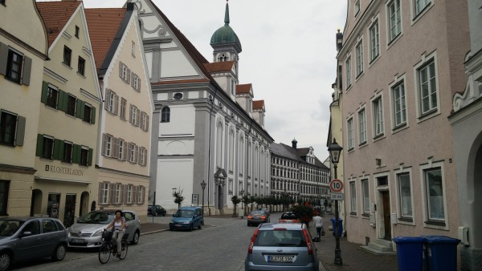

Germany. The land of pilsner, sausage, and lederhosen. What could it possibly hold for a tee-totaling vegetarian who tries to avoid wearing leather? I wasn't sure what to expect in Germany, but it's rapidly becoming one of my favorite countries. The beautiful high Rhine, the black forest, and the lively, clean, and safe down-towns have been great to experience. And, the Germans themselves have been absolutely awesome.

### Germany

I entered Germany having somehow failed to appreciate how developed and important the country is. For instance, here are a few interesting facts I've come across:

Germany...

- is the most populous EU country (substantially larger than France or the UK).
- has the second most olympic medals, after the USA, more than the USSR (though the counting is difficult because the two times that Germany hosted the olympics, they were interrupted by World Wars; and because Germany has participated under five different names).
- has exports roughly equal to those of the USA, even though its population is one-fourth of the US's (80 vs 320 million).

Those are some pretty impressive stats. So, by some measures (especially its exports), Germany is a true global power. I've certainly seen that so far: the country teems with huge, immaculate chemical and manufacturing plants. And, its wealth is obvious in the quality of the cars on the road and the quality of its construction and infrastructure. At least in Baden-Württemberg and Bavaria where I am traveling, nearly every building is clean and well-maintained, has high-quality plumbing and HVAC systems, and is tasteful and built to modern standards.

\[caption id="attachment_715" align="alignnone" width="600"\] This downtown is typical of the German cities I've visited: clean, orderly, well-planned, and tasteful, with high-quality construction that does not cut corners.\[/caption\]

And while we're at it, here are a few more interesting factoids: one-quarter of Americans claim German ancestry. The violent crime rate in Germany is about 1/7th that of the US, and the age of consent is 14 (?!).

### The Route

The Euro Velo 6 route in Germany started at Bodensee (Lake Constance), and it continued North through the Germany's Black Forest, crossing the continental divide from the watershed of the Rhine to the enormous watershed of the Danube.

\[caption id="attachment_727" align="alignnone" width="600"\] View South into the black forest from the continental divide.\[/caption\]

After meeting the very small danube (which it will follow all the way to the black sea), the route meanders through through rocky hillsides that reminded me a bit of parts of California. These pictures really don't do it justice, since they were taken on a rainy, disgusting day.

\[gallery type="rectangular" ids="726,725,724,722"\]

I especially liked this little picnic table art installation in the middle of the river.

Once the Danube passes these hills and arrives in the flatter valley area, its surroundings become much more developed. Every 5-10 kilometers, the bike path passes another village.  Nearly every village had a gorgeous little Bavarian church.

So far, the biggest city I've passed through in Germany has been Ulm. I loved it for its vegetarian food and coffee shops (it's a hip little college town), but it's best known for having the tallest church spire in the world.

\[caption id="attachment_716" align="alignnone" width="600"\] Tallest church spire in the world in Ulm, Germany.\[/caption\]

From where I write this in Rodenberg (another great university city), the route continues towards Passau, Germany, the last substantial German city before Austria.

### Language

> I speak Spanish to God, Italian to women, French to men, and German to my horse. - _Charles V, Holy Roman Emperor._

I find this to be a hilarious quote. And I've decided that if I ever have a dog again, I will train it to respond to German, because it is a language that is well suited to the imperative form. Unfortunately, I think that the no-nonsense sound of the language helps to proliferate various negative stereotypes of Germans--that they are too serious, or confrontational, or humorless--which are in my experience completely off-base.

And, while it's true that German can sound a bit funny (to my ears, at least), it can also sound quite beautiful. I especially like to hear it spoken by groups of older men, who often speak slowly in deep resonant voices. It has a lot of character and it is very powerful.

As a side note, I found a word on a menu that has three letter-t's in a row: "aufschnittteller". I asked the waitress, and it was *not* a misspelling. After some in-depth research, I'd say that it translates loosely as '[meat plate](https://translate.google.com/#de/en/aufschnittteller)'.

However, I am learning almost no German in Germany, because everyone speaks English. And, people under about 35 speak it *incredibly* well. In fact, I have trouble telling the difference between native British english-speakers, and well-spoken Germans. To top it off, Germans do not have a stick up their ass about which language they are speaking like the French do. For the most part, it seems like they just want to communicate ideas in the most efficient way possible. They know that it is unrealistic to expect most travellers to learn German, so they don't expect us to.

It's so refreshing to be in a country where I can talk to people again -- it has completely changed my experience on this trip. I am trying to enjoy it while it lasts, because I doubt that Eastern Europeans will be so proficient in English.

### **Food**

This one caught me off guard: it is very easy to get high-quality vegetarian food in Germany. In fact, it has one of the highest rates of vegetarianism in Europe, and is much higher than the US.

**Rates of Vegetarianism by Country**

- Germany: 9%
- Switzerland: 9%
- Great Britain: 6%
- USA: 3%
- Austria: 3%
- France: <2%

Also, they have awesome breakfasts. As I write this, I am staring at a breakfast buffet with the following food: 3 types of bread, assorted fruit, 5 types of cheese, two types of yogurt, 2 types of jam, honey, scrambled eggs, hardboiled eggs, bacon, assorted deli meats, oatmeal, muesli, dried fruit, assorted seeds, milk, coffee, tea, and orange juice.   And, it's included for free with my €42/night hotel (all taxes included). Let's call that breakfast a 10/10. But, German breakfasts are great across the board. I'd rate the German youth hostels ring at about 7.5/10, and the cheapest hotels at 6/10, with the typical American continental breakfast coming in at around 2.5/10.

But, I must not forget to the describe the wonderful German salad.

\[caption id="attachment_729" align="alignnone" width="600"\] German Salad (picture borrowed from the web)\[/caption\]

I've had this salad included as part of pretty much every lunch or dinner I've had in Bavaria. As the base of the salad, the bowl is filled with adjacent scoops of fresh, raw sauerkraut (which is mild and crunchy compared to canned stuff); a scoop of shredded carrots; a scoop of pickled beats; and maybe some corn. Then, it is covered with a handful of lettuce that is decidedly *not* icebert or romaine. It's more like butter lettuce, but it comes in different colors. Then, there's a bit of dressing -- but not too much, because the flavor really comes from the veggies on the bottom. It's an *awesome* salad due to its great taste and sheer mass of vegetables that would otherwise be disgusting if not in this salad, and I will be recreating it as soon as I'm a real person with a kitchen again.

### People

I have *literally* never met a German I didn't like. Previously, I'd only met traveling Germans, usually in hostels or as couchsurfing guests, so I thought maybe they would be different in the Fatherland. But nope, they're the same! They are fun, earnest, goofy, interested, well-educated, and just generally unaffected and genuine. I usually find it easy to strike up a conversation with Germans and keep it going for a long time. Perhaps we're just interested in the same things.

So, how do Germans sometimes get a reputation as being rude, demanding, or [humorless](http://www.telegraph.co.uk/culture/8560815/Germany-officially-the-worlds-least-funny-country.html)? I think it comes from Germans (1) strongly separating work life from social life, so that if you encounter a German on the job you will find him or her to be very serious; (2) not being socialized in a strongly extroverted culture, so that they don't feel compelled to smile and nod at every stranger they see; (3) valuing directness, and not taking so much offense at confrontation; and (4) having the misfortune of speaking a serious-sounding language.

<iframe src="https://www.youtube.com/embed/M6mndRtsS88?rel=0" width="420" height="315" frameborder="0" allowfullscreen="allowfullscreen"></iframe>

The thing is, all of those factors are superficial, and they fall away as soon as you get into a real conversation.

Also: after seeing these Germans in operation (even down here in predominantly Catholic Bavaria), I'm wondering if what we consider to be a 'protestant work ethic' in the US is really more of a German work ethic. I will continue exploring this hypothesis...

### Biking

At some point in France, Dee and I got into a deep conversation with an American couple who were in their 70's, but who still spent three years biking the world. We talked for a while, and they gave us lots of advice on life, relationships, and living to the fullest. I immediately forgot all of it, except that I did remember the guy telling me about this thing called a *German Bike Poncho*. I anxiously searched for such an item all through France, but it wasn't until reaching the Donau in Germany that I finally found one.

\[caption id="attachment_714" align="alignnone" width="500"\] The model in this picture actually is not me, but the German Bike Poncho is realistic.\[/caption\]

The German Bike Poncho is just as amazing as I'd hoped. It stretches way out over the handlebars to protect your arms, hands, and legs from rain. Plus, it has straps and elastic in all the right places to keep it from billowing out in the wind. So, it keeps you dry, while at the same time allowing enough ventilation to keep you cool and unsweaty. Granted, it is a bit parachute-ish in the wind, but since I'm so ploddingly slow on my bike, it hardly matters.

In other news, after about four weeks of my hands being constantly numb and stingy, I finally re-taped my handlebars. I added about 15 layers of handlebar tape, so that the top of the bars look and feel like big black marshmallows. It's awesome: I can now almost feel my fingertips again. It's the biggest quality of life improvement I've experienced since being toilet trained.

### So,

The trip has been going great.  I've been spending lots of time alone just cruising along on my bike, but that was kind of the point, and I think it's been productive. However, I am getting a bit tired to being in the saddle, so I am going to spend a day or two in beautiful Regensburg, Germany. After that, it won't take long to make it to Austria, where I expect to get my first faint hints of Eastern Europe.
