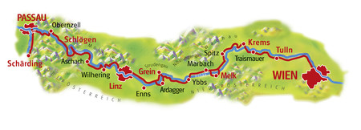
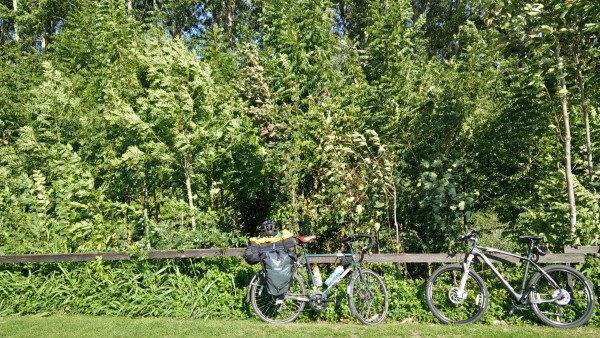
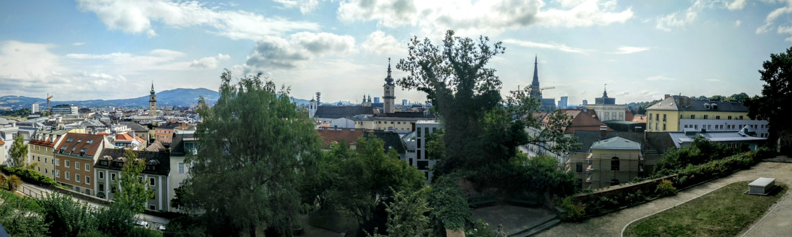
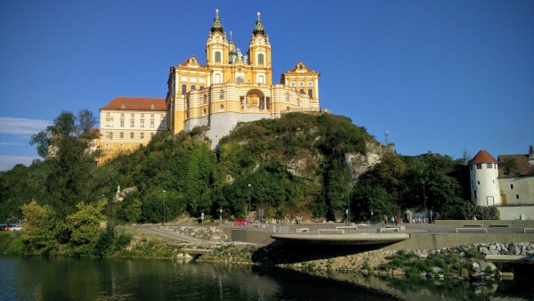
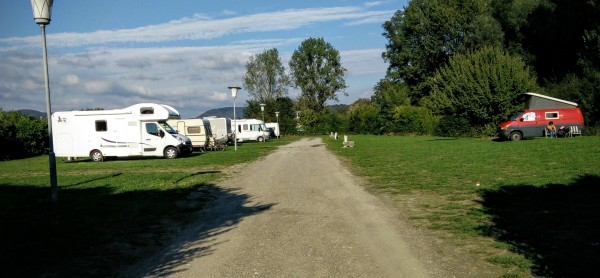
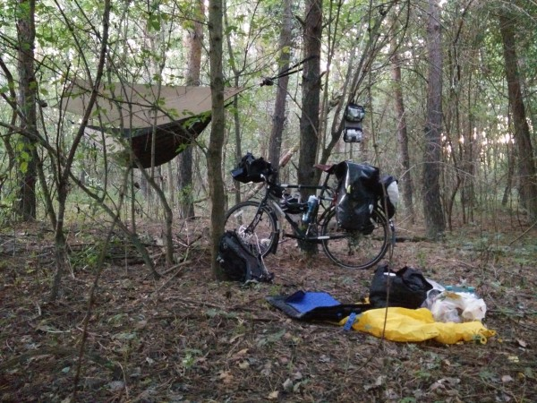

_(Note: this entry covers travel up to around Sep. 13)_

While planning my trip, I was excited to begin my journey into Eastern Europe when I crossed the border from Germany to Austria. I'm not really sure why I thought that Austria was part of Eastern Europe. Maybe because there used to be an Austro-Hungarian Empire? I also thought that it used to be the center of the Ottoman Empire. Like most Americans Westerners People Who Aren't Literally Living in Eastern Europe, I was pretty much clueless about Eastern European geography and history, and equally so about Austria. So, I will now give you a simple mathematical equation to explain Austria to you.

_Austria = Germany \* 0.1_

This equation applies in most cases. Austria's population, its amount of exports, and the size of the economy are almost perfectly proportional to Germany, except that it is a bit more sparsely populated. The exceptions to this equation are quantities which are not proportional to size, in which case, approximately:

_Austria = Germany_

They both speak German (with the usual differing dialects, which also happens in Germany), they have similar per capita incomes, levels of education, and they seem to share predominantly the same television shows, literature, etc..  One substantial difference is that Austria is predominantly Catholic, and is perhaps a bit more conservative. In this, it is very similar to Bavaria, in Germany.

So, to sum that up, Austria is a highly developed Western European country that is very similar to and highly integrated with Germany. It stands in stark contrast to Central or Eastern Europe (Poland, Hungary, Romania, Bulgaria, the Balkans, etc.) which were part of the former Soviet bloc. Those countries are much poorer (aka, more affordable), speak mystifying slavic languages, and are much less integrated with Western Europe.

Anyways, I share these observations only because I was so surprised at my complete misunderstanding of Austria.

### The Danube Bike Path through Austria

The section of the Danube bike path Austria from Passau, Germany to Vienna, Austria is the second most popular bike path in Europe (following the path around Lake Constance, which I also partially travelled).

\[caption id="attachment_771" align="alignnone" width="450"\] The extremely popular Austrian section of the Danube bike path stretches from Passau (on the edge of Germany), then along the Austria-Germany border through a beautiful stretch of mountains to Linz, and then through rolling hills and plains of Austria, to Vienna (Wien).\[/caption\]

Around 600,000 people use the route every year, and 55,000 of them do the entire thing. As such, the tourist facilities are highly developed. The 340 km route is littered with convenient bathrooms, ferries, restaurants, and guesthouses (although, interestingly, the facilities were highly geared towards German speakers--I don't think this route is that popular with foreigners.)

Most of the route follows beautiful gorges, vineyards, and small historic towns.

\[gallery type="rectangular" ids="766,765,763,769"\]

The weather was pretty good for this section, except for a persistent and infuriating headwind.

\[caption id="attachment_751" align="alignnone" width="600"\] An infuriating headwind assailed me all through Austria, as demonstrated by the way the trees are swaying in this photo.\[/caption\]

### Linz

After Passau, this first major city on the route is Linz. On the one hand, Linz is the birthplace of Hitler and was planned as one of the industrial and cultural centers of the third reich. On the other hand, that seems to be behind it, and I found Linz to be a fascinating, beautiful, and easy-to-navigate city.

\[caption id="attachment_767" align="alignnone" width="1170"\] Panorama of Linz, Austria taken from the fantastic Schlossmuseum (castle museum)\[/caption\]

### Mauthausen

After Linz, I visited Mauthausen, Austria, which is a famous nazi death camp. This camp was primarily used as a labor camp for political prisoners and the intelligentsia (as opposed to other camps which were general-purpose or which were used for ethnic cleansing).  Around 200,000 prisoners died there.

\[gallery type="rectangular" ids="762,761,760,759,758,757"\]

I was surprised by my reaction to Mauthausen: I simply didn't want to be there. It was so depressing, and so unnerving, that I only stayed for about an hour. Whereas I found my visit to Normandy and to the cemeteries there to be both sad and fascinating, Mauthausen just felt repulsive.

### Melk

After the depressing visit to Mauthausen, I was glad to visit Melk, home of a famous Benedictine Abbey. The abbey is truly incredible in its scale and decadence, especially since it sits in a rural and otherwise unassuming town. As a must-see stop for the cruise boats going up and down the Danube, it was swamped with throngs of tourists, a surprising number of whom were American.

\[caption id="attachment_756" align="alignnone" width="600"\] Famous Benedictine Abbey (is there another type of abbey?) at Melk.\[/caption\]

### Wild Camping

As I approached Vienna, I decided to finally try 'wild camping': camping in the woods, without permission. Most cyclists I met never wild camped, but a minority of the cyclists wild camped *every night*, thereby gaining tons of flexibility and saving a lot of money. I personally don't mind paying for campsites, but the problem is that German and Austrian campsites were basically just parking lots.

\[caption id="attachment_764" align="alignnone" width="600"\] Typical campsite in Germany or Austria.\[/caption\]

They were crowded, featureless, and most importantly they didn't have *any* free-standing trees where I could hang my backpacking hammock. So, wild camping it was!

\[caption id="attachment_752" align="alignnone" width="600"\] My first wild-camping campsite.\[/caption\]

It only took me 10 or so minutes to find a nice, isolated patch of woods to camp in. My backpacking hammock blends in nicely with the forest, so I didn't worry about drawing attention.

However, I must say, it is much more unnerving to camp alone in the woods, than to camp in a crowded campsite. I know that the woods are *statistically* safe, but it is an eerie feeling to be alone, overnight, in a forest.

As if to drive the point home, I woke in the middle of the night to an animal running full-speed through my camp. I was immediately wide awake. I told myself that it was probably a squirrel or something, since even small animals sound *enormous* in the dark, in the woods.

But, a few seconds later, I heard an animal (probably the same one that ran through the camp?)  *growling* about twenty meters away. I'm pretty sure it wasn't a dog or a wolf; it was a very monotone growl. Still, it was terrifying. But, I told myself that, you know, the woods are *statistically* safe. Eventually, I got back to sleep. Several people told that it was probably a wild boar, but I wonder if it wasn't just a deer or even something like a raccoon.

### Vienna

Vienna is the biggest city I've visited so far--a couple of million people. It used to be the biggest german-speaking city in the world, up until the 20th century (it's now second to Berlin), and it has a long history as the capital of Austria and of various associated empires. It's was the home city of Sigmund Freud, and has historically been a center for classical music and theater.

I really enjoyed Vienna, and I can see why people want to liv there. It's interesting with a rich history, but it's easy to navigate (with great public transit), it's clean and safe, and it has reasonable prices given it's amenities. Indeed, it ranks highly in many of quality-of-living indexes. I also enjoyed the Austrian aesthetic that is evident in Vienna--it's a lot less ornate and flashy than in a country like France, and it often seems to be a bit woodsy, or at least colorful.

In Vienna, I rented my first AirBnB apartment of the trip, for around three nights. It was great to have a place to settle down, and as always AirBnB was a great deal. While in Vienna, I was given a fantastic tour by a friend I'd made at a hostel earlier in Germany, and I also made some local friends. It was time very well spent, and I'll remember my trip to Vienna fondly.

\[gallery type="rectangular" ids="749,748"\]
