It's official: my bicycle trip across Europe has drawn to an end. It was an amazing trip through a beautiful part of the world. I'm glad I did it on a bicycle instead of on trains and busses, and I feel like it was a great use of a couple of months.

I hope to do a final post with some conclusions about what it's like to do a bike trip of that length, but below are some notes from the final stretch of my trip through Slovakia and Hungary, including two weeks in beautiful Budapest. Next up: learning Spanish in Guatemala.

### The Big Picture

It might be useful to think of Euro Velo 6 as being built of four sections:

1. In most of France, EV6 follows the famous and well-developed *Loire-a-Velo* route up the Loire river. The path is very safe and family-friendly.
2. From Eastern France, up until Passau (Germany), EV6 follows a mash-up of several cycling routes along various geographical features. Oftentimes, the route seems improvised, but the high standard of cycling infrastructure in France, Switzerland, and Germany means that the ride is pleasant and safe, regardless.
3. From Passau, Germany to Vienna, Austria (aka, "Wien") EV6 follows the famous danube cycle path. The cycling and tourist infrastructure is fantastic, and the scenery is amazing.
4. Finally, in the ~2000 km from Vienna (Wien) to Constanta (on the Black Sea), the route gets progressively less developed, and it passes through countries that are progressively less bicycle-friendly.

This blog posts covers my entry into the fourth, least-developed stage of the EV6 route.

\[caption id="attachment_809" align="alignnone" width="600"\][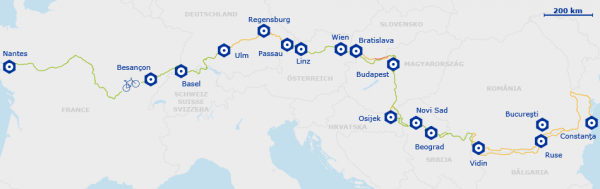](/wp-content/uploads/2015/10/ev6map.png) High-level map of Euro Velo 6\[/caption\]

### Bratislava, Slovakia

It's only a day's bicycle ride from Vienna to Bratislava. The ride was pleasant, and I met a surprising number of other cyclists, such that we had assembled a small peloton of sorts by the time we entered the city.

Bratislava is the capital of Slovakia. It is home to about half a million people, and it is unique among national capitals in that it borders two other countries: Austria and Hungary. Like so many other European cities, Bratislava has a fascinating downtown that owes its layout and many of its buildings to its medieval past.

\[caption id="attachment_790" align="alignnone" width="600"\][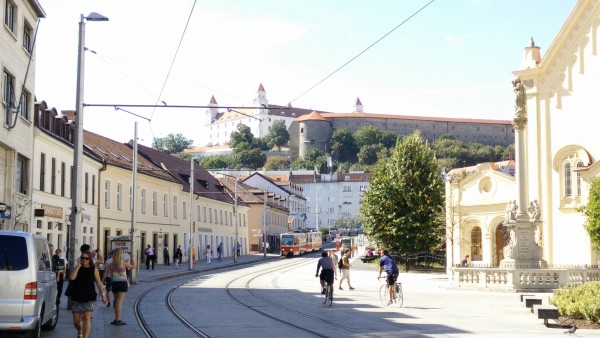](/wp-content/uploads/2015/10/IMG_20150917_121242.jpg) Downtown Bratislava, Slovakia.\[/caption\]

The charming downtown, however, is in stark contrast to the rest of Bratislava, which clearly bears the marks of the economic and cultural devastation that occurred during its time in the Soviet Bloc. According to a tour guide, the Soviet planners decided that although Bratislava was as beautiful as its Czech counterpart, Prague, there was no need for two cultural capitals, and so they set about systematically destroying Bratislava's historic buildings, and rebuilding the city as a model of centrally-planned Soviet efficiency. You can guess how successful that was. Although Bratislava is undergoing an impressive economic turnaround, it still struggles to rid itself of its stigma as an Eastern European backwater.

This problem was exacerbated by two recent films. Can you recall what they were?

The first is the 2004 movie Eurotrip. I really encourage you to watch at least a few seconds of this clip :)

<iframe src="https://www.youtube.com/embed/cqEsE-IKBI8?start=120" width="420" height="315" frameborder="0" allowfullscreen="allowfullscreen"></iframe>

The second is the 2005 movie Hostel.

[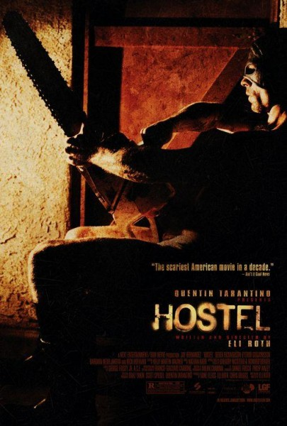](/wp-content/uploads/2015/10/Hostel_poster.jpg)

On the one hand, it is hilarious, because Bratislava does have such an Eastern-European feel compared to a city like Vienna, which is only *50 miles* away. On the other hand, it is completely unfair to Bratislava, which is actually a nice place to visit, and which is doing its best to overcome a difficult history that it did nothing to deserve. In fact, in some areas it was quite vibrant. And, although I didn't have time to visit any other areas in Slovakia, I hear that it is absolutely gorgeous.

### Entering Hungary

The Danube, upon leaving Bratislava, is drastically altered by the [Gabčíkovo–Nagymaros Dam](https://en.wikipedia.org/wiki/Gab%C4%8D%C3%ADkovo%E2%80%93Nagymaros_Dams)s, a huge and controversial project. Interestingly, the dam has actually changed the course of the river. Since the river is the border between Slovakia and Hungary, it has led to an unusual border dispute. For me, however the consequences of the dam were straightforward: extremely flat, uninterrupted, high-quality cycling paths. Not only that-I was *finally* biking with a tailwind. It was great cycling.

\[caption id="attachment_791" align="alignnone" width="600"\][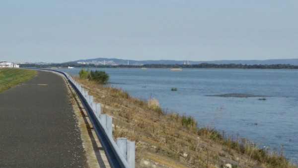](/wp-content/uploads/2015/10/IMG_20150918_110010.jpg) Great cycling paths behind the Gabčíkovo–Nagymaros Dams.\[/caption\]

Once I passed the dam and the route deviated a bit inland into Hungary, I began to encounter more rural and underdeveloped areas. The path was coarse gravel, which made for slow cycling, and I often had to stop for farm animals on the path.

\[caption id="attachment_792" align="alignnone" width="600"\][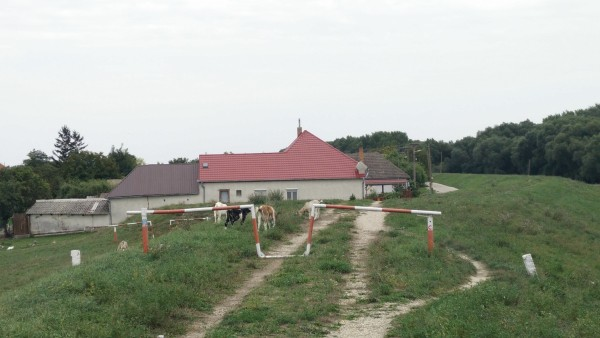](/wp-content/uploads/2015/10/IMG_20150918_151058.jpg) Goats on the bike path in rural Hungary.\[/caption\]

About a day before reaching Budapest, I began to encounter much less enjoyable cycling paths. The scene below is typical:

\[caption id="attachment_811" align="alignnone" width="600"\][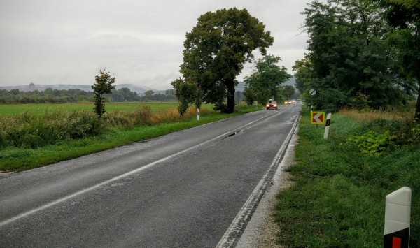](/wp-content/uploads/2015/10/IMG_20150926_145300-1.jpg) Less-than-enjoyable 'Cycling Route'.\[/caption\]

These routes often had a few unfortunate things in common:

1. Narrow-ish roads with no usable shoulder.
2. Cracked and crumbling edges that force bikers further into the traffic lanes.
3. Lots of automobile traffic, especially trucks.
4. Drivers who aren't used to giving bikers space.

Regardless of the beautiful scenery, I simply don't enjoy biking in these conditions. And, according to the few other cyclists I met, these conditions persist and actually get much worse as the route continues into Serbia and then out to the Black Sea.

So, I made the obvious decision:  I had no interest in biking through 2,000 km of dangerous roads with shortening days and cold weather, but I was very keen to spend some time in Budapest and then get on to my next adventure. So, about 100km before reaching Budapest, I decided that Budapest it make a great finishing point.

### A Third Visit to Paris!

Simultaneously with deciding to end the trip, I had an opportunity to join up with my Mom and her friend Karen; they were both visiting Paris and staying at a relative's apartment. So, I got to spend a wonderful week with them, as well as to visit the Louvre and take a day trip into Belgium.

\[gallery type="rectangular" ids="796,795,794"\]

### Budapest

As I approached Budapest, the bike lanes improved, the restaurants started serving vegetarian foods other than fried cheese, and there were finally other people riding bicycles for reasons other than being a child or not owning a car. It was clear that I was in for a treat.

I simply cannot say enough good things about Budapest. It would be great to visit for a day, a week, a month, or a year. It combines the wealth of history and culture of a city like Vienna, with the size and vibrance of a city like Boston. And, at least for now, it is extremely affordable—living as a tourist in Budapest costs about a fourth as much as in a city like New York or Paris.

Budapest is a city of around two million people. It’s the capital of Hungary, and is its largest and most important city. It was formed in 1873 by combining two separate cities, which face each other across the Danube. Buda is situated in the rolling Buda hills, which remind me of the hills of Berkeley, California. Pest, which sprawls across the plains on the opposite side of the river, contains most of the buildings and institutions of interest. Nowadays, Pest is considered to be substantially more lively, loud, and young than reserved and residential Buda.

\[caption id="attachment_800" align="alignnone" width="600"\][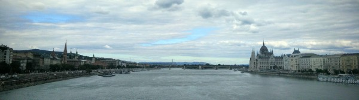](/wp-content/uploads/2015/10/IMG_20150929_143909.jpg) Budapest, with Pest on the left, Margaret Island in the middle, and Buda (with its famous Parliament building) on the right.\[/caption\]

[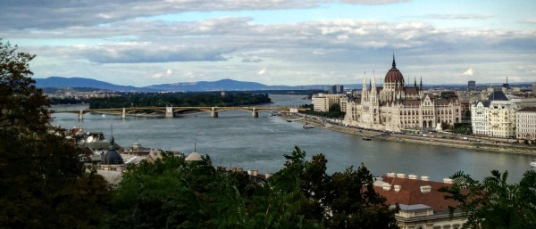](/wp-content/uploads/2015/10/IMG_20150929_154504.jpg)

One of my favorite day trips was biking out to the Elizabeth Lookout, a lookout tower on the highest hill (526 m) in the Buda hills. It was a pretty tough ride, in part because I was constantly getting lost and basically bushwhacking on my bike up parts of the hill. The view back over Buda, towards the Danube and Pest, was wonderful.

\[caption id="attachment_802" align="alignnone" width="600"\][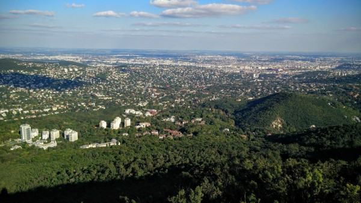](/wp-content/uploads/2015/10/IMG_20151001_155034.jpg) Budapest, viewed from the Elizabeth Lookout.\[/caption\]

The view of the city at night, also, was breathtaking. I haven’t seen many sights that could compete with beauty and ambiance of Budapest at night along the Danube.

\[caption id="attachment_803" align="alignnone" width="600"\][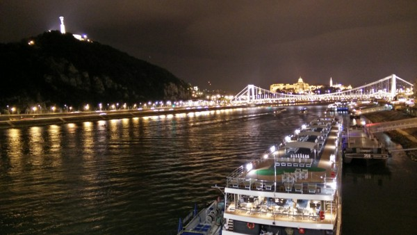](/wp-content/uploads/2015/10/IMG_20151009_194125.jpg) The Danube and Budapest at night.\[/caption\]

\[caption id="attachment_804" align="alignnone" width="600"\][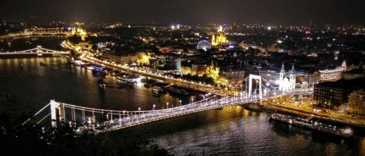](/wp-content/uploads/2015/10/IMG_20151009_200343.jpg) The Danube and Budapest at night, viewed from the Citadel.\[/caption\]

\[caption id="attachment_808" align="alignnone" width="600"\][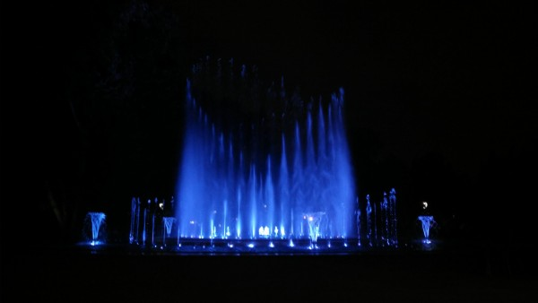](/wp-content/uploads/2015/10/IMG_20151007_193841.jpg) Fountains with a light show on Margaret Island.\[/caption\]

However, I must admit, even though I was in Budapest for around two weeks, I did not live up to my traditional standards of relentless sightseeing and picture taking. Instead, I spent most of my time with the various travelers and locals that I met.

For instance, after two months of passing by beautiful European vineyards on my bike, I finally went wine tasting with some friends from the local law school. It was a beautiful setting with live music, great cheese, great food, and carefully staged photo opportunities.

\[caption id="attachment_806" align="alignnone" width="600"\][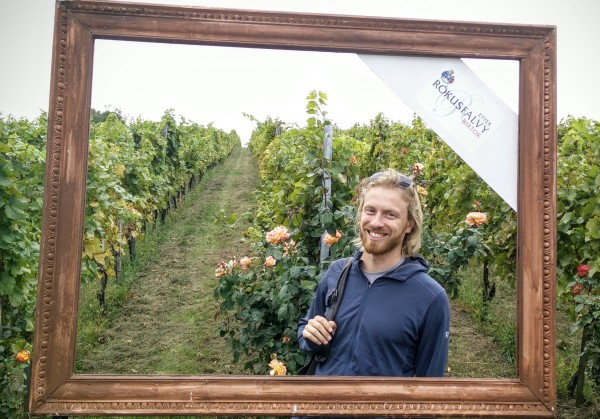](/wp-content/uploads/2015/10/IMG_20151003_1411012.jpg) Candid photo, not at all staged.\[/caption\]

On another night, we checked out a pipe organ concert at the beautiful St. Stephen’s Basilica in central Pest. I make a point of seeking out concerts at churches with truly magnificent pipe organs — they are amazing machines capable of such a wide array of sounds, and they must be so difficult to play. I love the way that the organs echo off of the churches’ ceilings and walls, so that you can actually hear the size of the building. This concert featured a flutist, and that was about as exciting as it sounds. However, to compensate, there was also an ancient and dour-looking male vocalist whose voice echoed magnificently through the basilica. And, speaking of the basilica, I really appreciated its unusually tasteful and non-violent religious imagery, which was a real change of pace from the other European churches I visited. And, to complete the experience, it turned out that we had to bribe our way in, since ticket sales had ended just before we arrived. We even ended up saving a few bucks—it was very Eastern European.

\[caption id="attachment_805" align="alignnone" width="600"\][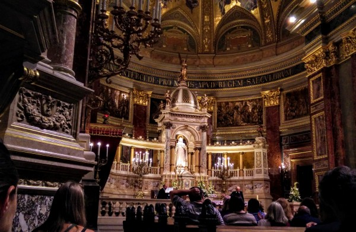](/wp-content/uploads/2015/10/IMG_20151001_204827.jpg) Organ concert in St. Stephen's Basilica, Budapest.\[/caption\]

A final experience that I’ll mention was a visit to the famous Szechenyi baths (the largest medicinal bath in Europe), which is situated in the beautiful and lively City Park in Budapest. We visited the two huge baths outside, as well as five or six indoor pools, along with an aromatherapy sauna. Each bath was unique in its aesthetic, its temperature, and its architecture. Some had beautiful fountains in them, while one had a little circular whirlpool that would spin you around. It was an awesome experience that I'll never forget.

\[caption id="attachment_807" align="alignnone" width="600"\][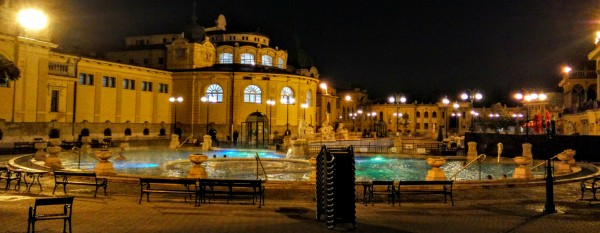](/wp-content/uploads/2015/10/IMG_20151006_2133372.jpg) The Szechenyi Thermal Baths\[/caption\]

I leave Budapest with a very heavy heart, wishing I could stay, but aware that I have to leave eventually, and that the adventures I have planned will bring new experiences of their own.

### Next Steps

As I write this blog, I have finished a brief visit to Pennsylvania to drop off my bike and touch base with my family, and I am on an airplane to Guatemala.

My plan is to spend the next 5 or 6 weeks learning Spanish at a Spanish school in the city of San Pedro La Laguna, on Lake Atitlan. Guatemala is famous for its affordable but high-quality Spanish schools, and the one that I’m going to is regarded as one of the best and most beautiful of them.

I’ve always dreamed of being able to speak another language, and I can't wait to get started. I will probably be back in the US for thanksgiving, and I will definitely be back for Christmas.
