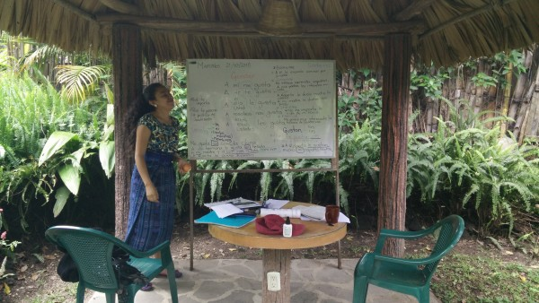
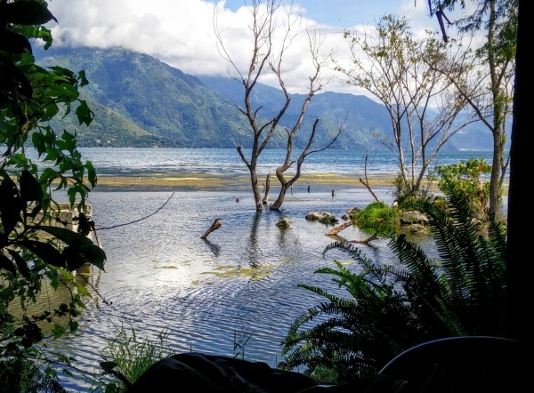
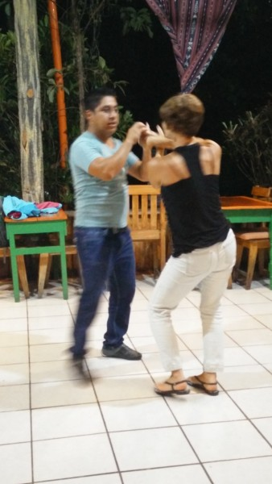
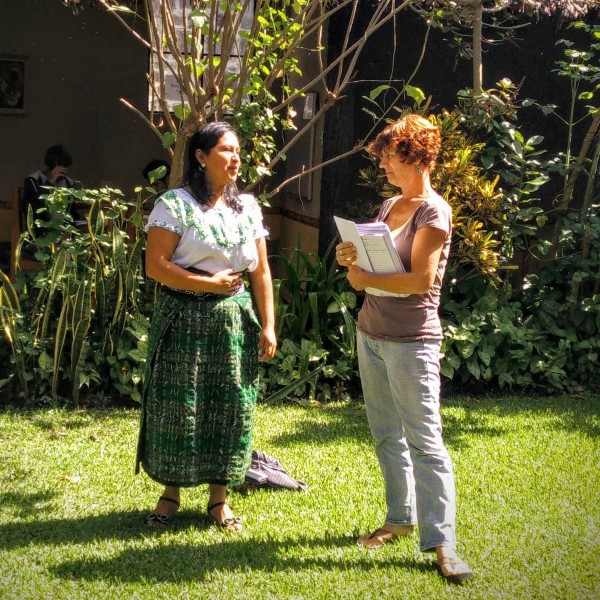
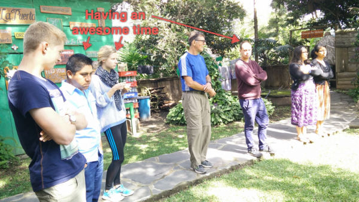
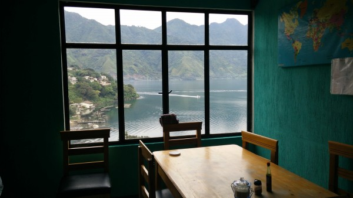

Ever since I finished refusing to learn a single thing in my completely free but compulsory foreign language education in high school, I've wondered why I was so determined to squander my opportunity to become bilingual. In my travels, I've often wished that I could actually communicate with the locals, instead of just pointing cluelessly at menu items in restaurants. And, I've been fascinated by people who are fluent in multiple languages: I've always wondered what it felt like to be be in their head, switching between different sets of words and grammar.

So, I headed to Guatemala to take Spanish lessons.

My thought process was as follows: I want to learn a language. Spanish is the 2nd-most popular language in the US, and is very widely spoken outside of the US. Spanish will give me access both to interesting budget-friendly countries in Central and South America, as well as to Spain itself. And, just as importantly, Spanish is much easier for me than other languages. I learn much better from books and writing than I do by ear, and Spanish is very easy to translate between speech and writing.

Okay, so that's why I wanted to learn Spanish. But, where to go? I've heard from accomplished language learners that (1) immersion in the new language is critical, and that (2) private lessons are *vastly* preferable to group lessons. So, I wanted a country that's cheap enough to afford private lessons, and which speaks a clean, universal variant of Spanish. Two countries are really popular for this: Honduras and Guatemala. I was lucky to find a website called [Guatemala365](http://www.guatemala365.com/) that has reviews and rankings for Guatemalan Spanish Schools, and I got turned on to the [San Pedro Spanish School](http://www.sanpedrospanishschool.org/), which happened to have some openings.

### San Pedro Spanish School

The [San Pedro Spanish School](http://www.sanpedrospanishschool.org/) is one of the oldest and most well-organized language schools in Guatemala. I have 5 hours per day of private classes with Rosita, who is an *amazing* teacher who knows Spanish grammar inside and out, and who clearly has a passion for learning and for helping people. Having a fun and interesting teacher makes it that much easier to stay awake in class!

\[caption id="attachment_826" align="alignnone" width="600"\] Rosita and I have classes in one of many cabañas on the school's luscious property.\[/caption\]

The school is located on the shores of [Lake Atitlan](https://en.wikipedia.org/wiki/Lake_Atitl%C3%A1n), which is considered by many people (and not just the people that live there!) to be the "most beautiful lake in the world". It was formed by three huge volcanoes, and it doesn't have an outlet. The water simply filters down through the volcanic rock, and consequently, the water levels rise and fall capriciously. Because it's at a high elevation but near the equator, the weather is perfect, averaging around 70 degrees year round.

\[caption id="attachment_827" align="alignnone" width="600"\] View of Lake Atitlan from the San Pedro Spanish School. This is the view that I often had during my lessons. Note the partially submersed trees (due to rising water levels).\[/caption\]

Beyond language lessons, the school also has a nice cafe and nightly activities.

\[caption id="attachment_835" align="alignnone" width="338"\] Free salsa lessons with Eligio, the king of Salsa.\[/caption\]

Each week, there is a ceremony for graduating students. Note the traditional traje (suit) that the professor is wearing -- virtually all the women in town wear these beautiful, traditional dresses, which are quite expensive.

\[caption id="attachment_837" align="alignnone" width="600"\] Graduation ceremony for Susan\[/caption\]

You can see how much the other students enjoyed the ceremony.

\[caption id="attachment_844" align="alignnone" width="600"\] The audience for the graduation ceremony.\[/caption\]

### Fun in San Pedro La Laguna, Guatemala.

My lessons take 5 hours per day, and I have 1-2 hours of conversation club and other planned Spanish-language activities. Between these, I spend an hour or two speaking Spanish with my host family during meals, and another hour or two studying Spanish. Still, I find some time for fun activities around San Pedro. For instance, there was a great diving platform in San Marcos, which we kayaked to. I also took a great hike to the top of the San Pedro volcano. It was one of the best views of my life.

\[video width="480" height="720" mp4="/wp-content/uploads/2015/10/VID_20151024_153640.mp4"\]\[/video\]

\[gallery type="rectangular" ids="832,831,833"\]

\[gallery type="rectangular" ids="838,839,840"\]

### My Host Family

I am living with a great host family: Marina (mom), Clemente (dad), and three sons Estaban, Clemen, and Junior. Marina cooks three unbelievable meals every day, and the whole family has been great about inviting me into their lives, and about putting up with my terrible Spanish. They trusted me to take Clemen and Junior to their soccer game (which they erroneously think is called 'football'), and to Estaban's High School Graduation. It's been a great experience!

\[caption id="attachment_824" align="alignnone" width="600"\] The beautiful view from the kitchen of my host family.\[/caption\]

\[gallery type="rectangular" ids="828,829,830"\]

### But, what about the Spanish?

I have been learning Spanish at what seems to me to be an incredible rate. I still have a really long ways to go, but at this point I can speak pretty comfortable about day-to-day topics, albeit at a slow rate. I can read pretty well, although speaking and listening are of course a bit harder. Right now, I'm struggling to assimilate a bunch of new verb tenses, but things are really starting to gel.

This weekend will mark the end of my third week of Spanish classes, and I hope to head to either Antigua or Quetzaltenango for further lessons, as well as to learn how to dance Salsa. It's been a great (but sometimes exhausting) time so far, and I'm hoping that I can continue this learning process as I return to the US for the holidays, so that I can keep practicing as I travel in Latin America in the new year.
