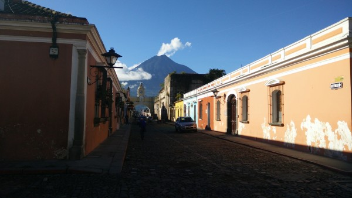

My 5 weeks of Spanish immersion in Guatemala are over. It was an amazing way to learn a new language. I'm certainly not fluent, and not even really conversational, but I do have a great base of Spanish that will make it much easier to travel in Latin America in the coming months.

As much as I loved my Spanish teacher, my homestay family, and my study environment in San Pedro on Lake Atitlan, I decided that it was time to move on to another city. The problem was that I had two goals in Guatemala: one was to learn Spanish, and other was to learn to dance Salsa. And, San Pedro was simply too small to offer dedicated salsa classes.

I considered heading on to Xela (Quetzaltenango), a relatively large, diverse, and 'authentic' Guatemalan city. However, there weren't any spots available at the schools I wanted to attend there. So, I headed to Antigua: a very touristy, but also very historic and beautiful, town of 35,000 people. I spent the last two weeks of my five-week Guatemala trip there.

### Antigua

Antigua was once the capital of Guatemala, but it was abandoned following a huge earthquake in 1773. It has since been re-inhabited and listed as a UNESCO world heritage site. A concentrated effort by the city to encourage tourism (largely by becoming the go-to destination for learning Spanish in central America) has helped to become surprisingly safe, clean, well-preserved, and prosperous compared to many other Guatemalan cities. Although it's nearly equatorial, its elevation of about 1 mile means that the temperature is mild and pleasant year-round.

\[caption id="attachment_860" align="aligncenter" width="600"\] The main street in Antigua, with the volcano Agua in the background.\[/caption\]

Antigua is famous for its grid of charming one-story buildings, its cobblestone streets, and its backdrop of impressive and ominously close-by volcanoes. Although I wouldn't have wanted to stay too long if were simply traveling, I found the city to be great for relaxing and taking Spanish and Salsa lessons. I particularly enjoyed how easy it was to get around as a pedestrian on the cobblestone streets (which tended to slow down traffic to a crawl). I also loved watching the surrounding volcanoes, which were big enough to create small weather and cloud systems of their own. One night, the volcano Fuego was erupting so strongly that I was able to easily capture it on my smartphone camera.

\[gallery type="rectangular" ids="854,855"\]

### Spanish School in Antigua

I spent two weeks at the [Don Pedro Spanish School](http://www.donpedrospanishschool.com/), doing 6 hours per day of classes. The school was a bit less focused on teaching Spanish than the San Pedro school, but it also did a much better job of organizing activities and fostering a bit of community. Overall I enjoyed both, and I'm glad I did them in the order I did.

After five weeks of classes, I feel both surprised at how much I've learned, and amazed at how much is left to learn. For instance, I can hold pretty comfortable and non-stressful conversations about most day-to-day subjects... for instance, shopping; ordering food; discussing my day's plans and the previous day's activities; talking about my family and where I'm from; and talking about places I've been and what they're like. I can talk in the present tense pretty easily, and I can talk in the past and future tenses much more slowly and with more errors. However, it's unbelievable how much more idiom, vocabulary, connotation, and grammar I'd have to know to actually pass as a native speaker. Overall, I think it was a great way to learn Spanish, and I'm eager to continue using it as I go on to travel more in Latin America.

\[gallery type="rectangular" ids="862,861"\]

\[gallery type="rectangular" ids="858,857,856"\]

### Climbing Volcán Acatenango

My favorite activity in Antigua was climbing the mostly-dormant Acatenango Volcano to get a great view of the very active Fuego volcano. I went with an organized group of about 24 other people, which meant that we went slowly, but also that I got to meet tons of new people. One of the couples that was staying in the same tent as me even got engaged during the trip. And even though there was a lot of rain, fog, and dampness, we did get some amazing views of Fuego when the clouds cleared. We could hear it erupting the entire night.

\[gallery type="rectangular" ids="852,853,859,867"\]

### Homestay Family

While in Antigua, I stayed with a great homestay family: parents Renee and Zincrid, and children Stephanie and Reneecito. The parents were in a salsa band that played several times per week in town, but music ran in the blood of the entire family. They were an exciting and interesting family to visit, and their very modern house even had real hot water, a rarity in Guatemala.

\[caption id="attachment_864" align="aligncenter" width="600"\] Zincrid on-stage with the family's salsa band, with family friend Jorge on keyboards. The dance floor was cleared for the two best dancers I've ever seen.\[/caption\]

### Salsa Lessons

Although I was a bit less serious about Spanish in Antigua than I was in San Pedro, I did get a chance to learn how to Salsa dance. I got to try some group lessons, some private lessons, and eventually I even began to go out at night to the Salsa clubs in Antigua. I loved it - it's a fun, healthy, and interesting way to spend a night out. I hope to continue learning salsa and other latin dances so I can keep it up in a few months when I return to Latin America.

\[video width="1280" height="720" mp4="/wp-content/uploads/2015/11/Salsa.mp4"\]\[/video\]

_Video: Salsa dancing lessons with my teacher, Nancy, in Antigua. She's awesome at salsa dancing, and totally tones it down so as not to embarrass me._

For now, though, I'm back in the US to visit with some family, attend a meditation retreat in Santa Cruz, and then to head back up to New Hampshire to do some contract work at Creare for a couple of months. It will be great to see my New Hampshire friends again.
