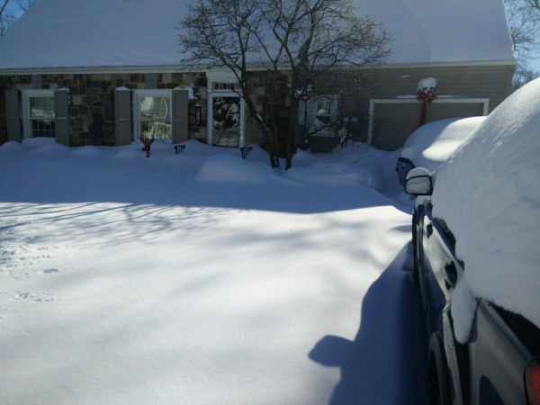
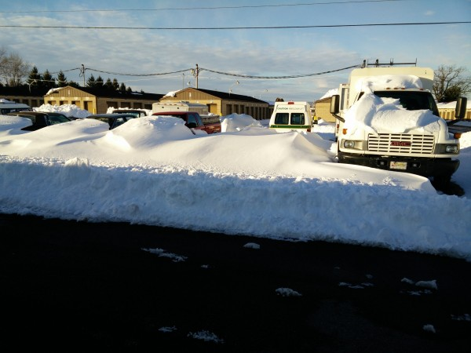
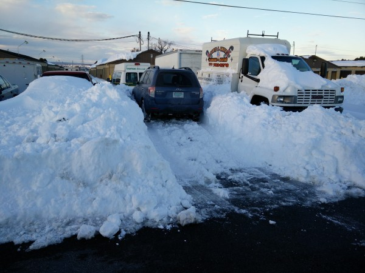
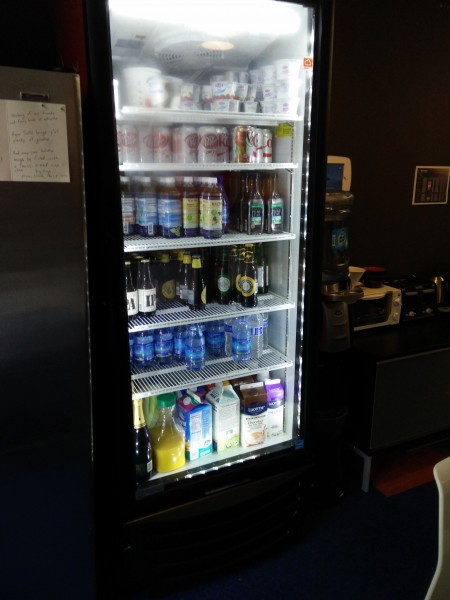
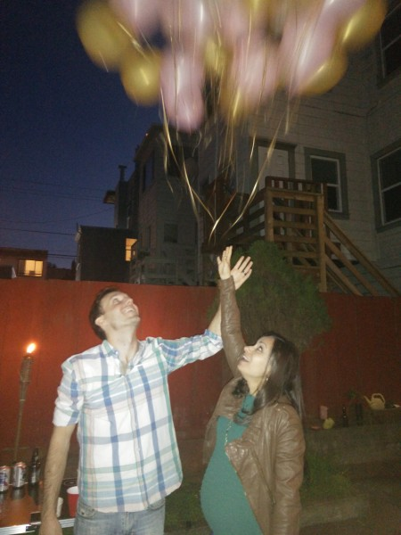
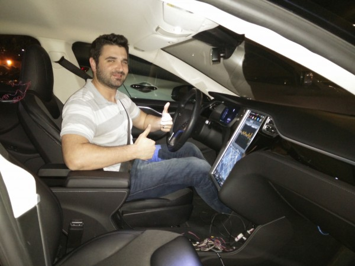
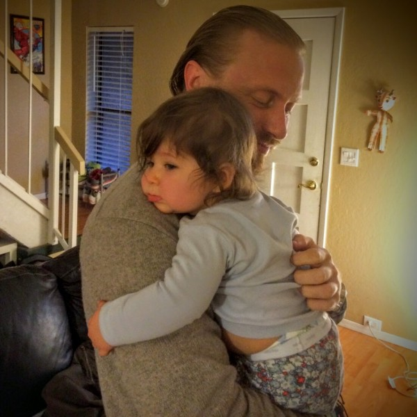

After a number of exciting adventures, I decided to tone it down a notch and spend a few months working again. I don't want the traveling to become rote, and I also want to keep my technical skillset and my pocketbook in good shape. So, I spent about six weeks working back at Creare in New Hampshire, and then four weeks working for my friends' company, [Whistle](http://www.whistle.com), in San Francisco. I learned a ton, made some great new friends, and recharged myself for my next round of travel in Latin America.

### Brief Visit in PA

First, I looped through my home base at my dad's house in Easton, PA to visit him and Susie, as well as to visit my mom. My car turned on immediately after several months of neglect, but I ended up having to spend a ton of money to get it ready for the trip to NH. In the meantime, the weather was so warm that I got to dust off my old Surly and bike _sans panniers_ on the beautiful PA canal paths.

\[gallery type="rectangular" ids="918,916,913"\]

### Working for Creare in New Hampshire, Dec 9 - Jan 22

I felt incredibly lucky to be able to return to Creare for about six weeks to help out with some of my favorite projects. I was able to focus entirely on software development, since I no longer had management or sales responsibilities. It was nice to work that way, but I definitely missed being "in the loop" on project decisions. And, it was astonishing to see, once again, how many different tasks some of the Creare engineers are juggling at once.

I got to see old friends like Matt, Brendan, Ariane, Charlotte, Rachel, Gina, the VIMS crew, and of course Julie and Ryan. Over Christmas, I was able to visit my whole family in Bethlehem, PA, and I got to touch base with high school friends Kristen and Jared. At one point, I visited Emily, Brian, and Dee in Boston. It was a busy time!

I also made new friends, such as my botanist friend and fellow Vipassana enthusiast, Betsy. We took a bunch of salsa lessons together, and even headed down to Manchester, NH for their very friendly and fun salsa night (who would have thought it?). It was great to make a new friend in such limited time, and it turns out Betsy will most likely even visit me in Oaxaca in April.

It was fascinating to see Creare again with fresh eyes, and to witness some of the changes and exciting new work going on there. Creare is so busy right now! It was also nice to not live out of a backpack for a few weeks: I had a backpack plus, like, a couple of suitcases. And a car. It was luxurious.

### Braving the Snowpocalypse in Pennsylvania

Once again, I stopped through Pennsylvania to see family and switch out my belongings. This time, I needed to pack for my gig in San Francisco, as well as for my Latin America trip and a possible sojourn to Southeast Asia. It was challenging to plan for so many social and climactic environments in a single small-ish backpack.

Even worse, my timing and my path from Bethlehem, PA to Newark, NJ coincided almost exactly with the worst snowfall from the [Jan 2016 Northeast US Blizzard](https://en.wikipedia.org/wiki/January_2016_United_States_blizzard), an extreme category-5 blizzard that dropped around 3 feet of snow in about a day.

When I showed up at my mom's house the day after the storm, the 3 feet of snow had so immobilized the town that I had to park illegally on a snow emergency route several blocks away. But, the snow around her house was so deep that, without a shovel of my own, I literally could not reach her. I just called her on the cellphone from the sidewalk, waved helplessly, and asked her to please find a handyman to shovel her driveway while I rushed to deal with my own challenges.

\[caption id="attachment\_915" align="alignnone" width="600"\] Mom's house was basically unreachable until someone could shovel a path to it.\[/caption\]

Next up, I arrived at my storage unit to find that the parking place for my car was occupied by a car-sized snow drift, as well as a dense snowbank deposited by a plow.

\[caption id="attachment\_902" align="alignnone" width="600"\] Where I needed to park my car.\[/caption\]

After a sweaty hour or so, and a willingness to compact a great deal of snow using the momentum of my car, I was able to lodge my Forester sufficiently far into the snowbank and climb out of the trunk.

Furthermore, since my mom was basically home-bound by the snow, I quickly booked a one-way car rental to take me to the Newark airport the following day. Unfortunately, I had no way to get from my parked car to the car rental agency about 10 miles away. The local cab company had a multiple-hour wait, and I wasn't sure they would show up anyways. _Once again_, Uber came to the rescue with a predictable, affordable, easy ride across the Lehigh Valley. I am simply amazed how often Uber saves me huge amounts of trouble and expense on these trips.

Even the following day, traffic was snarled from the snowpocalypse. I had to take some adventurous detours on the way to Newark, and I ended up _barely_ making my flight, to the point that the check-in counter had to warn the employees at the gate that I was coming.

### Working with Kevin and Nate at Whistle in San Francisco, Jan 25-Feb 20

Finally, I was off to San Francisco to work with my college buddies Kevin and Nate at [Whistle](http://www.whistle.com). Kevin is CTO and co-founder at Whistle, and Nate is a senior engineer / data scientist. I've been keeping close track of Whistle since their early days. Their first product was a dog activity tracker (sort of like a fitbit), and their second product is a GPS dog tracker (which helps you find your dog if it's lost). They're growing remarkably quickly, and I jumped at the opportunity to work for them for a few weeks.

My project was to pull together a bunch of data and help with analyzing it and making it accessible to other employees within the company. It was really fun to work in such a motivated and tight-knit company. And, of course, the best part was to work with Kevin and Nate. The company had an awesome startup vibe - free catered lunches (which I loved much more than I ever thought I would), complementary drinks and snacks, and an open seating plan. Also, pretty much everything they did, virtual or otherwise, involved some type of hip service provider whose name ends in 'ly' or 'ify'.

One of my favorite moments was during a big conference call between Whistle HQ, multiple remote employees, and another conference room in another city. This massive video call was done through Google Hangouts (which is great for this, BTW). And, since Whistle creates connected devices for dogs, there were at least a dozen dogs present on the call. So, every time that a dog would bark (which was often), the videoconference software would switch the video feed to that dog, who would invariably be doing something hilarious.

Another favorite moment was witnessing a very important meeting in which Kevin and the other two co-founders announced some huge and long-awaited company news. It was great to see how far Kevin's come in his career, and to witness a real moment of triumph for a good friend.

\[caption id="attachment\_905" align="alignnone" width="450"\] Amazing fridge full of unlimited free beer, soda, and food at Whistle.\[/caption\]

It was also an especially neat time to visit Kevin and Alina, since they are expecting their first child in April (I think. Don't quote me on that.)

\[caption id="attachment\_908" align="alignnone" width="450"\] Kevin and Alina at the KevLina Baby Shower\[/caption\]

And, as always, a visit to the Bay Area wouldn't be complete without a visit to my old Creare colleague, Nick Mancini, who has now moved on from Apple to Tesla. He even borrowed a Model S from work for us to ride in, since he knew that was a dream of mine. It was an incredible piece of technology, and it was great to see Nick again.

\[caption id="attachment\_907" align="alignnone" width="600"\] Nick in a Tesla Model S\[/caption\]

My last week in SF was especially fulfilling and intense, with hiking in the South Bay, going out in Santa Cruz, shuttlig back and forth on Caltrain. I was extremely sad to leave SF behind, but at least I was able to look forward to visiting my friends Jared and Kristen during a stopover in Phoenix.

### Phoenix: Visiting Jared and Kristen, Feb 21-23

Jared and Kristen's daughter, Stella, is now nine years old. I am lucky that, even though the Emershaws live in Phoenix, this was my third time meeting her. She has been growing and developing so quickly.

\[caption id="attachment\_912" align="alignnone" width="600"\] 9-month-old Stella Emershaw\[/caption\]

More than anything else, it was humbling and inspiring to see how hard Jared and Kristen work to provide a safe and nurturing environment for Stella. They are doing an amazing job and I can't wait to see how Stella develops.

\[gallery type="rectangular" ids="909,910,911"\]
