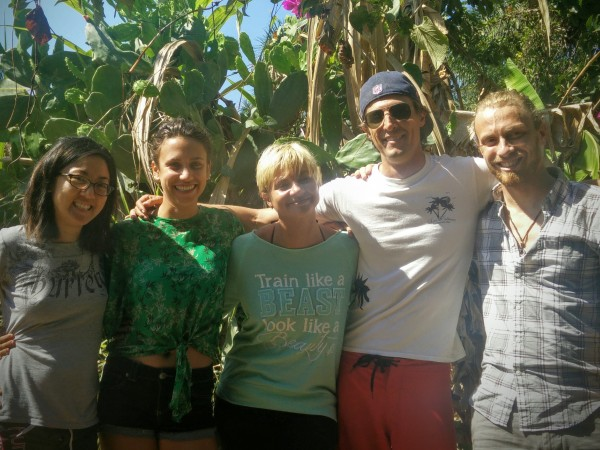

Having spent a month getting a head-start on my Spanish in Guatemala, and having then spent about two and a half months working at Creare and at Whistle, I decided that it was time to enjoy traveling for a while in a Spanish-speaking country. I considered Argentina or Chile to start with, since it would be summer there, but I ended up joining up with my friend Corina in Mexico. I've always felt interested in Mexico, since it has such a deep connection to the U.S., but I've also felt that in the U.S. we don't get a very accurate impression of what Mexico is like. So, we found some cheap tickets to Puerto Vallarta, Mexico, and booked a week's stay at a small surf school to get us started.

 

\[gallery type="rectangular" ids="931"\]

Puerto Vallarta (pop. 200,000) is a tourism-focused port town on the West Coast of Mexico. It is probably most famous for (a) having an incredible concentration of retired and/or vacationing American tourists, and (b) for having a sizeable gay/lesbian culture.

I was, quite frankly, astounded by how clean, pleasant, and appealing Puerto Vallarta was. To be clear, it is not a town where you get an authentic, spanish-language Mexican experience. However, it is a nice middle-ground between that authentic experience (especially in some of the further reaches of the town) and a Miami-like American experience (which is most evident in the gleaming port where the cruise ships dock). Even more impressive was that P.V. exhibited none of the problems I expected: it wasn't dirty, I was almost never hastled by shop owners or beggars, it didn't feel unsafe, and the locals seemed to get along well with the tourists. You can even drink the water in P.V.! If you're looking for a nice, easy, pleasant family vacation at an affordable price, you should consider Puerto Vallarta.

\[gallery type="rectangular" ids="932"\]

After a single night in PV, we moved on to our first main stop: the [San Pancho Surf House](http://www.surfhousesanpancho.com/). It was a nice place to start out, since Corina's parents are friends with the owners. The school is like a small bed and breakfast that includes surfing instruction and excursions 6 days a week with its two married owners, Bianca (a Romanian) and Luis (a Mexican). It is located in a small fishing-village-turned-expat-hangout named San Pancho, about half an hour north of PV.

Bianca and Luis were great instructors. Their main goal was to get us out on the ocean, positioned in just the right place, and then to give our surfboard a little push at just the right time, to help us catch the wave. They were careful not to overwhelm us with too much instruction, but instead to simply let us develop a feel for the board and the waves. Unfortunately, due to sickness, I only had about 3 days of surfing. But, I was able to get up consistently whenever Luis would give me an extra push, and I even caught a couple of waves on my own.

Overall, surfing was super cool and fun, but I would also note that it is a _ton_ of work. It's a struggle to fin and get out td the right waves, and then once you do, you spend the vast majority of your time on your stomach trying to paddle back out through crashing waves get back in position. Even though I'm glad I tried it, I've concluded that for now surfing is not my sport. But for people who love beach culture and who love just being in the ocean, it's a great excuse to get out on the water, and I could see how addicting the challenge could be.

\[caption id="attachment\_933" align="alignnone" width="600"\] The surf house crew\[/caption\]

### Guadalajara

After our week in San Poncho, Corina decided to stay longer at the Surf House to enjoy San Pancho and plan her next steps, while I continued on to Guadalajara (metro area pop. 4.3 million), the second-biggest city in Mexico. Guadalajara just didn't seem that big - it was livable and easy to navigate. I decided to take a biking tour to take in the sights (only recently did this type of thing become possible). I was only person on the tour. My guide Ana was German and, as I tend to with Germans, I thought she was pretty awesome.

\[gallery type="rectangular" ids="926,934,935,927,939"\]

After tour, I decided to back to the Instituto Cultural Cabañas, where there were some very famous murals by José Clemente Orozco.

\[gallery type="rectangular" ids="928,929,936,938"\]

I absolutely loved the murals. First of all, Fresco is a neat artform because it appears to be very challenging to do, and it requires the artist to work quickly. Secondly, murals are neat because they are difficult to move, so they tend to remain physically and culturally connected to their area of origin. And, finally, these murals were on curved surfaces, so one of the fun ways to appreciate them is to see how they change when viewed from different angles.

As I was walking around in front of the institute, I had a fun moment that challenged my Spanish. Two middle-school-aged girls tapped me on the back and asked me if I would answer some cultural questions. Clearly, this was for a school project, and they felt pretty excited to have cornered a gringo. My Spanish had really atrophied by that point, and they didn't speak English at all, so I tried to explain that I couldn't really answer the questions clearly in Spanish. Yet, they persisted, nearly begging me to take part, so of course I complied. To my horror, they brought out the video camera and microphone, and I realized that my floundering Spanish would probably be projected in front of an entire classroom. That was bad enough - but then, as the interviewer started speaking into her microphone, I heard her voice projected out of the megaphone strapped to her back.

I probably turned white as a sheet, realizing that my unintelligible Spanish was about to be amplified through the megaphone for the amusement of the growing crowd. Yet, it was impossible to back out, so I went through with it. At one point, I remember expounding on how Mexico has given so much to U.S. culture, including tacos and also Selena Gomez. I have to say that the crowd and especially these middle school girls absolutely loved those two examples. It was a ridiculous situation, but also a good opportunity for me to practice getting out of my shell and being willing to make an ass of myself for the amusement of others.

### Overall

Our week at the Surf House gave me a chance to really, really, really slow down. In retrospect, I really needed this down time after having virtually constant activity and movement for the past few months. I was surprised how much stress and momentum I had accumulated. But, a week there was the right amount of time. Afterwards, Guadalajara was a nice and convenient stop, but not necessarily a place I'd want to spend more than a couple of days. However, the next place city I visited, Guanajuato, was astounding. I look forward to writing about it in my next post.
