On my way from Guadalajara to the famous Monarch Butterfly Reserves, I planned to spend two nights in a University town called Guanajuato. But, within minutes of arriving, fell in love with the town. It was so historic, walkable, and appealing that before the night was over I had found a local Spanish school, organized a homestay with a local family, and settled in for a two-week stay.

\[caption id="attachment_965" align="aligncenter" width="600"\][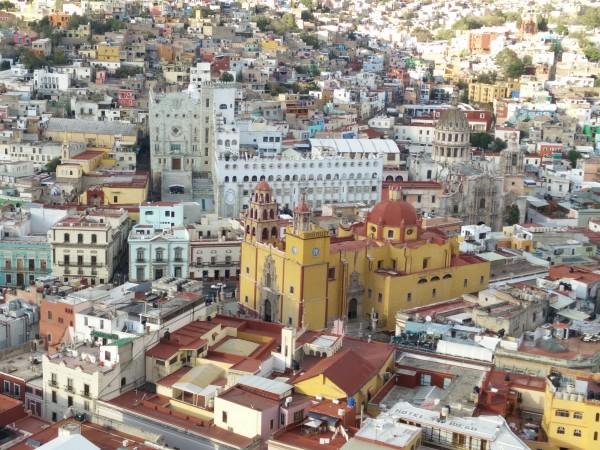](/wp-content/uploads/2016/04/IMG_20160311_174852.jpg) View of Guanajuato from El Pípila. I've always felt like this picture looks fake for some reason.\[/caption\]

Guanajuato (pop 172,000) is located to the Northwest of Mexico city, in a semi-arid and mountainous region at a height of around 6,600 ft.. Along with being the modern-day capital of Guanajuato State (which includes the manufacturing center of León, known as the 'capital de zapatos' for producing many of the shoes exported to the US), Guanajuato has a rich silver-mining history. At one point near the turn of the 19th century, it produced around 2/3 of the world's silver.

\[caption id="attachment_966" align="aligncenter" width="600"\]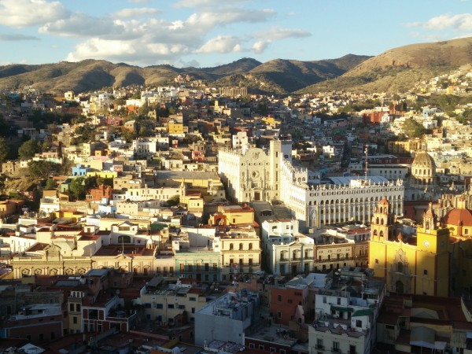 Another View of Guanajuato from El Pípila\[/caption\]

Nowadays the silver mining is more or less defunct, and central Guanajuato has developed into a tourist city that is very well-known in Mexico but relatively unknown outside of it. (It is clear, however, that this situation is changing).

Guanajuato combines the bright colors of a traditional desert town with the magnificent vistas and preposterously steep alleys and staircases of a mountain town.

\[caption id="attachment_964" align="aligncenter" width="600"\][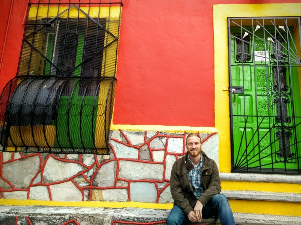](/wp-content/uploads/2016/04/IMG_20160311_1715312.jpg) Guanajuato is filled with colorful, beautiful buildings that ooze character.\[/caption\]

The roads and _callejones_ (alleys) feed down to a network of small gardens, village squares, and university and civic buildings that occupy a very compact and walkable city center.

\[caption id="attachment_958" align="aligncenter" width="600"\][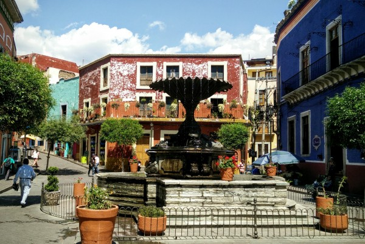](/wp-content/uploads/2016/04/IMG_20160306_1329463.jpg) Numerous neighborhood squares are filled with street food, performers, and amorous university students. Although this square was one of the more run-down, it was one of my favorites.\[/caption\]

The large university population, combined with the consistent influx of tourists, made for a thriving arts and street performer scene.

\[caption id="attachment_959" align="aligncenter" width="600"\][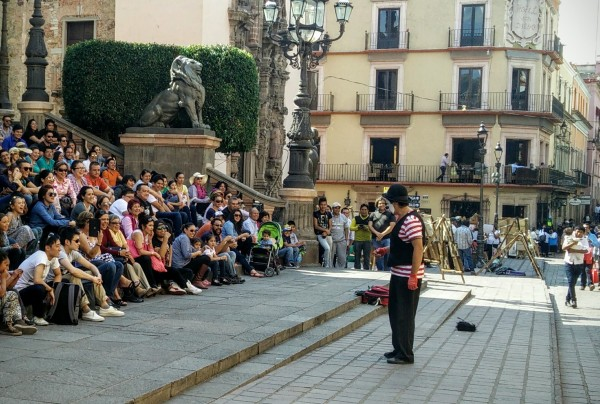](/wp-content/uploads/2016/04/IMG_20160306_1508292.jpg) Mimes, clowns, musicians, and dancers of widely varying quality perform daily for large, enthusiastic crowds.\[/caption\]

The quality of architecture in downtown Guanajuato was on par with anything else I've seen in Latin America, though of course it was limited in scale by the small size of the city.

\[caption id="attachment_956" align="aligncenter" width="600"\][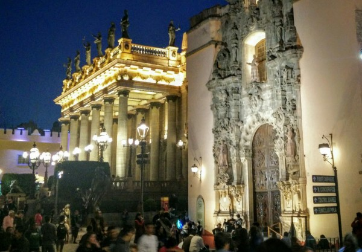](/wp-content/uploads/2016/04/IMG_20160304_1917363.jpg) Teatro Juarez, a relic of Guanajuato's rich colonial past and silver wealth, was gorgeous any time of day or night.\[/caption\]

Another famous feature of Guanajuato is the network of tunnels and sunken roads that divert traffic off of the main downtown streets. From what I could gather, this network was the result of (1) repurposing dried-out riverbeds after diverting the river due to years of flooding, (2) the necessity of tunneling through the mountain ridges that surround the town, and (3) the easily availability of money and tunneling equipment during the town's silver mining years. The tunnels are amazing for a town of its size.

\[caption id="attachment_957" align="aligncenter" width="455"\][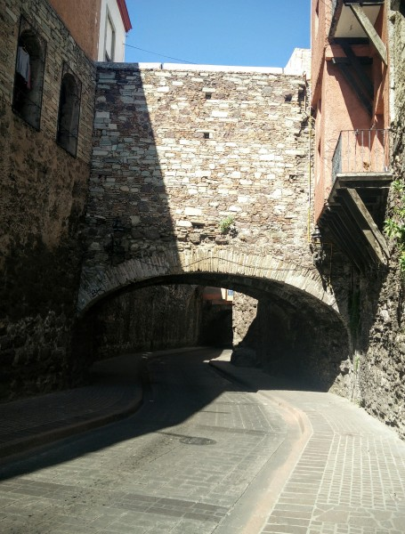](/wp-content/uploads/2016/04/IMG_20160306_1055582.jpg) A network of sunken roads and extensive underground tunnels keeps most vehicle traffic out of downtown streets.\[/caption\]

Guanajuato was very safe and clean, probably on par with most US cities. One minor annoyance was the difficulty of getting change for the 500-peso ($25 US) bills that the ATMs gave out. Any time I tried to break one of these bills, the cashier would make a huge show about how annoying it was to break the bill, even if your order came to 40-60% of the bill's value. Often, the shop owner would have to run to neighboring shops or even dip into his own wallet looking for change. I asked several shop owners about this, and they admitted that it's easy to get most types of change at the bank, so I suppose it's just cultural. And, the problem isn't limited to foreigners - locals find this annoying too. I got so tired to dealing with this that I remember at one point, as I was walking down a dark alley at night, I thought "Please, please don't anyone mug me right after I went to the trouble of breaking a 500-peso bill." I actually felt rich after breaking these large bills - I could finally buy whatever I wanted - while I would start to jealously guard my change and defer purchases as my reserve of small bills dwindled. Overall, while I expect these problems in a country like Argentina or India, I was surprised that this problem was so acute in a country as industrialized as Mexico.

While in Guanjuato, I stayed with a wonderful host family. They had several students at a time--both from the tourists from my Spanish school, as well as exchange students from the University--and they had been hosting in this way for 20 or 30 years. Still, Hortencia (the mother) was so indefatigable and kind that she spent at least 2-3 hours per day speaking Spanish with me.

\[caption id="attachment_961" align="aligncenter" width="600"\][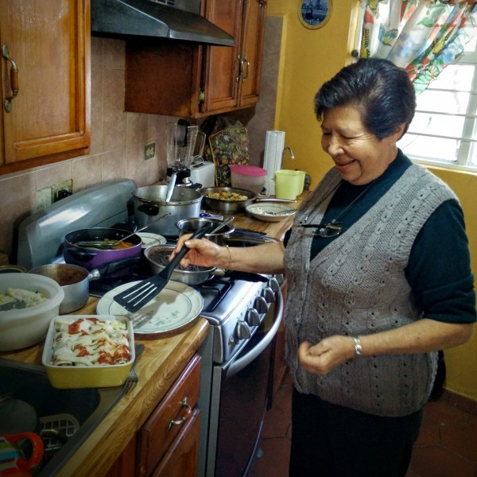](/wp-content/uploads/2016/04/IMG_20160310_1504282.jpg) Hortencia was an amazing homestay host. She spent hours every day stuffing me full of delicious Mexican food, all while correcting my Spanish and filling me in on the history and culture of Guanajuato.\[/caption\]

As always, my Spanish school proved to be an easy way to meet fascinating, friendly people. Whether we were hiking from neighboring villages, hanging out between classes, or spending a night out, I really enjoyed getting to know such a diverse group of people.

\[gallery type="rectangular" ids="960,953,954,955,963,969"\]

I also managed to fit in some salsa classes, although I continued to be hampered by my limited Spanish comprehension.

\[caption id="attachment_975" align="aligncenter" width="600"\][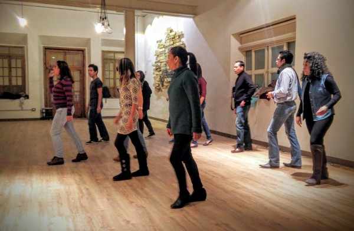](/wp-content/uploads/2016/05/IMG_20160310_201931-2-1.jpg) Nightly salsa classes\[/caption\]

The instructors speak very quickly, so it is really difficult to understand with so much music and background noise. Consequently, I mostly just tried to copy what they were doing. It was so bad that at one point, as I was copying a peculiar move where the instructor was rhythmically striking the floor with the ball of his foot, I realized that the whole class was laughing at me. It turned out that he was trying to dislodge a piece of gum from the floor, and I had mistaken it for a dance move. Nonetheless, the other students, tourists and locals alike, were incredibly accepting and encouraging of me.

As the week went on, I spent a ton of time with my good Mexican friend Karen, who initially helped me to find a language school in Guanajuato. She lived in the States for about a year and speaks great English. And, as a social worker in the surrounding communities, she was able to explain a lot to me about life in the poorer parts of Mexico. One of my favorite things we did together was to hike to La Bufa, a rock outcropping overlooking the town.

\[caption id="attachment_967" align="aligncenter" width="600"\][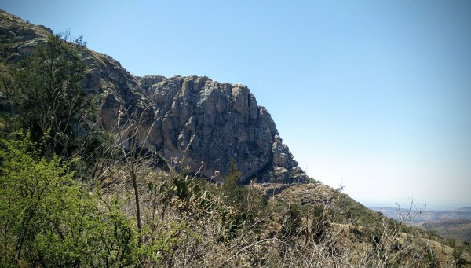](/wp-content/uploads/2016/04/IMG_20160312_1251192.jpg) La Bufa, a large rock outcropping overlooking Guanajuato\[/caption\]

\[caption id="attachment_968" align="aligncenter" width="600"\][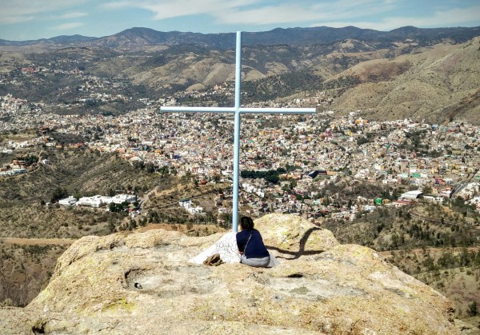](/wp-content/uploads/2016/04/IMG_20160312_1427342.jpg) Karen beating me to the summit of La Bufa.\[/caption\]

I absolutely loved my time in Guanjuato. It was great to visit, but it would also be a great place to live as an expat or retiree for anyone who wanted to live in a city that was safe and interesting, but much more authentic and Spanish-speaking than nearby San Miguel de Allende. I am determined to return there, since I missed some of the best sites, like the inside of Teatro Juarez and Teatro Principal, as well as the famous Museum of Mummies. It was surprising to have a city take such an unexpected hold on me. However, it seemed to have a similar effect on other travelers, and I'm sure the number of foreign tourists in the city will only continue to increase. I am lucky to have been one of them, and I hope that Guanajuato does not lose its accesiblity and charm.
