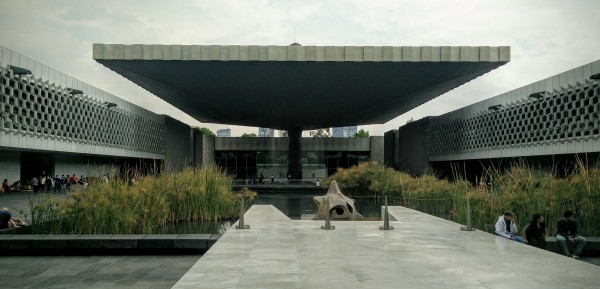
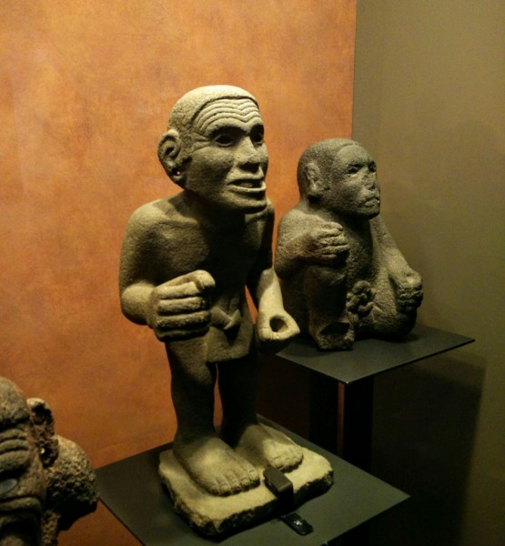
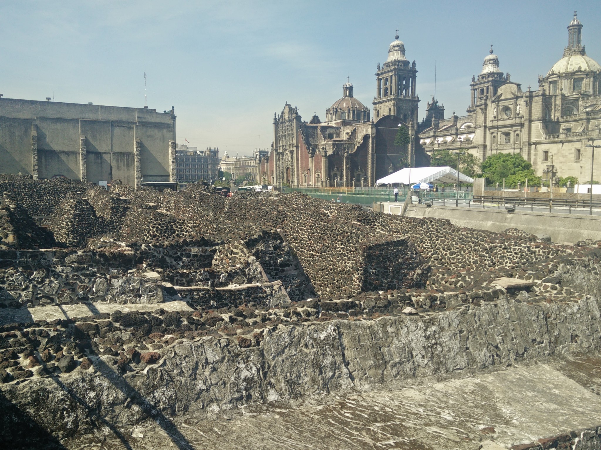
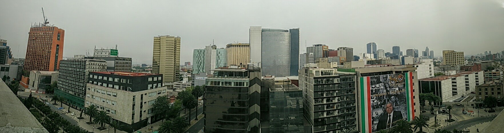
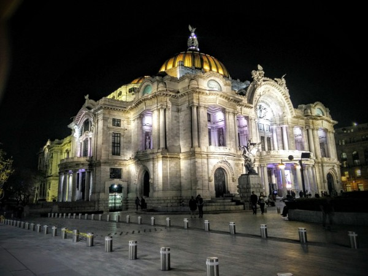
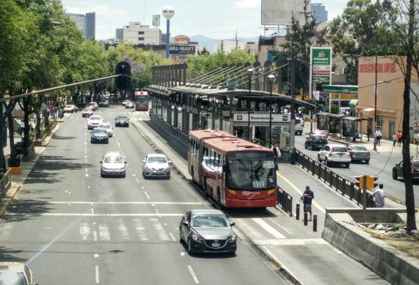
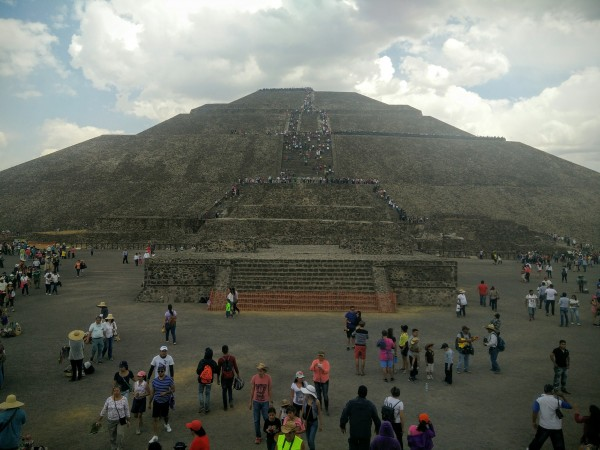
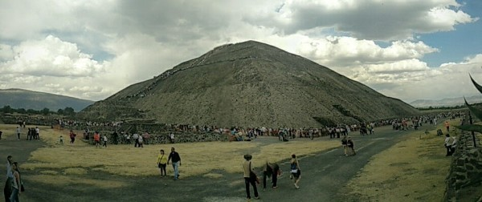
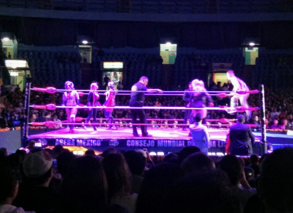

After Guanajuato, I decided to spent the week of Easter in Mexico City. Apparently, it's the best time of the year to visit, because everybody leaves the city to visit family or to go to the beach. Despite the worst pollution in decades (due to anomalous weather), I found Mexico City to be very approachable and fun to visit.

Since being built literally on top of the ancient Aztec capital of Tenochtitlan, which was itself located on somewhat of a man-made island in Lake Texcoco, Mexico City has grown tremendously. You would have no idea that the city were built in a former lake, if not for the fact that as the ground slowly dries out it continues to shift and settle, causing buildings to lean at odd angles and causing the magnificent paved courtyards to bulge and crumble.

The greater Mexico City area now has upwards of 20 million people, making it the largest city in the Western Hemisphere, and the largest Spanish-speaking city in the world. In decades past, it was known as being incredibly polluted and traffic-choked. Nowadays, the pollution has dropped by nearly an order of magnitude, and is correspondingly much, much better than similarly sized cities in Asia and India. Traffic continues to be among the worst in the world, but you can't say it's for lack of trying: the city has a very impressive subway, as well as a great bus rapid transit system and a incomprehensibly large network of city buses and collectivos.

I was lucky to have a fantastic tour guide for my week in Mexico City: my friend Karen, from Guanajuato, was in town visiting her family for the holidays, and was incredibly gracious in showing me all of the food, churches, parks, and live entertainment that I could handle.

Overall, I found Mexico City to be very interesting and easy to visit - the incredible food, affordable accommodation, and fascinating history provide great value. However, it is also a gritty, dusty, and noisy city.

### Museums and Ruins

I failed at checking out many of the museums that I'd meant to because either (a) they were closed, or (b) they were *swamped* with visitors with a line around the block (I'm looking at *you,* Frida Museum...). However, one incredible museum that I had no problem getting into is the beautiful Museo de Antropología.

\[caption id="attachment_986" align="alignnone" width="600"\] Museo Nacional de Antropología\[/caption\]

The museum had prehispanic relics of absolutely astonishing quantity and quality. And, although I greatly exceeded my limit on the number of artifacts that I can truly appreciate before I start daydreaming about lunch, I was fascinated by how contemporary and emotive some of the works seem, even though they were produced by cultures so totally isolated from European and Asian influence.

Another neat thing to visit in Mexico City is the ruins of the Great Pyramid (Templo Mayor). This temple was one of the largest and most important monuments of the Aztecs, and it was of course duly destroyed by the conquering Spanish. It wasn't until the 20th century that it was rediscovered during building excavations, and in fact it wasn't until the 1970's that real excavation began. The ruins are stunning in their size. And, since they are mere steps from the central square (_Zocalo_), the contrast between the old and new, and between indigenous and colonial, is stark.

\[caption id="attachment_995" align="alignnone" width="1170"\] Corner of the ruins of the Templo Mayor in downtown Mexico City.\[/caption\]

### Buildings

Although much is made of the historical buildings of Mexico City, I was far more impressed by the street food. The buildings are, for the most part, uninspired and boxy. Many are left vacant due to earthquakes or neglect. Older colonial buildings exist, but not in a tremendous density, and many are relatively unmaintained and sinking into the old lakebed. There are, surely, some fancy new buildings, but they are spread out among a number of smaller commercial centers.

\[caption id="attachment_992" align="alignnone" width="1763"\] Panorama of downtown Mexico City.\[/caption\]

One absolutely phenomenal building, however, is the Palacio de Bellas Artes. It's highly functional inside as a museum and a concert hall, and the outside is gorgeous in both the daytime and nighttime. The colored cupula is unique and charming, and the building is breathtaking from every angle.

\[caption id="attachment_994" align="alignnone" width="600"\] Palacio de Bellas Artes\[/caption\]

### Metrobus

I feel a duty to use this platform, meager though it may be, to lend my support to the Mexico City Metrobús system. This bus rapid transit system is essentially a bus system that behaves like a hybrid light-rail and subway system. These systems are common in Latin America and are characterized by:

- A small number of stops (compared to regular buses).
- Purpose-built bus platforms where riders must pay *before* entering the platform.
- Fully-dedicated bus lanes.

The system is new but it already has something like 6 lines, and moves 900,000 people per day. These systems are something like 10% as expensive as subways to build, and they are a joy to ride. You don't have to navigate underground caverns filled with the stench of human urine, and you get to see the city and the sunlight during your commute.  They're faster than cars, much faster than city buses, and are almost as fast as subways. And, they are easy-to-maintain and capable of steering around obstacles, unlike light rail.

To me, these kinds of buses are the real answer to the urban transit dilemma. Our problem in the US is that we never go the full distance: we don't have the fully-dedicated lanes that make the buses fast, and we don't have the limited-access bus platforms that make ingress/egress efficient. And then, we wonder why people prefer subways to buses.

\[caption id="attachment_991" align="alignnone" width="600"\] Mexico City Metrobús\[/caption\]

### Teotihúacan

Karen and I had an excellent daytrip to Teotihúacan, the famous complex of pre-colombian pyramids that includes the Avenue of the Dead.

The site is astonishing in its size and, the day that we went, it was equally astonishing in the quantity of Mexicans visiting it. The proximity of the Semana Santa Holidays to the Spring Equinox (an important date in the cosmology of the city) apparently created the perfect storm of tourism, and by a group of people who have a much higher tolerance for standing in line in the sun than I do.

Consequently, we were unable to summit the Pyramid of the Sun because the line to get into it was about four-people wide around the entire thing to the back.

I was literally dumbstruck that people were willing to stand in this line, in the sun. After talking to people in line about the rate of progress, I would estimate it as a 4-6 hour wait. Of course, on the bright side, had I actually been able to summit the pyramid in a reasonable amount of time, I probably would have soon forgotten about it. Instead, I got to witness a human spectacle of line-standing that I will remember with awe for the rest of my life.

### Lucha Libre

Finally, although I am no pro-wrestling aficionado, I have to give a shout-out to *Lucha Libre*, the Mexican equivalent of the WWF. Karen and I went (I believe it was her first time, too), and it was *awesome*. It is like American Professional Wrestling, but with a much lower degree of class, seriousness, and believability. If you can believe that. However, something about the characters and the venue is totally addictive and raw, and the sheer athleticism and talent of the performers is amazing. If you're ever in Mexico City, you *must* visit Lucha Libre.

\[caption id="attachment_990" align="alignnone" width="600"\] Lucha Libre\[/caption\]
