Oaxaca ("whoa-hahk-uh", I think) is one of the most famous regions of Mexico, and not just because of its awesome name. It's famous for its indigenous culture, its incredible and diverse cuisine (especially mole), and its handicrafts (particularly textiles and hand painted goods). I spent about 3 weeks in Oaxaca, and I recommend it highly as an amazing tourist destination that you can easily visit from the US.

Before visiting the city of Oaxaca, I decided to check out Puerto Escondido, a famous expat and surfer hangout on the Pacific coast of Oaxaca. It was a last minute decision that had to do with more with bus schedules than with actually wanting to go to the beach, but I figured I might spend a week or two there learning Spanish. Unfortunately, I *once again* realized that I hate hot humid weather, don't care for the beach or beach culture, and am pretty  ambivalent about the ocean. After suffering through a few mind numbing conversations with expat beach bums, and after spending as much time as I could stand lounging at the beach bring sunburned and  having sand blown in my eyes (about 5 minutes), I decided to move on to the capital city of Oaxaca. Which, also, is named Oaxaca.

### Oaxaca

Oaxaca is a fun, active, celebratory city. One of my favorite parts of visiting it were the constant wedding celebrations, which involve fireworks, huge public displays of music and dancing that last far into the night, and of course, giant dancing effigies of the bride and groom.

\[caption id="attachment_1002" align="aligncenter" width="600"\][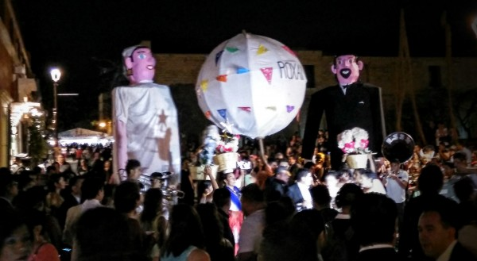](/wp-content/uploads/2016/06/IMG_20160402_193350.jpg) Oaxacan wedding celebration\[/caption\]

In the daytime, much of the city life revolves around the beautiful, always-busy central square.

\[caption id="attachment_1020" align="aligncenter" width="600"\][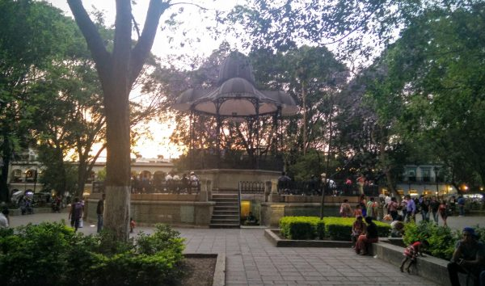](/wp-content/uploads/2016/06/IMG_20160329_183413.jpg) Oaxaca central square\[/caption\]

### Spanish school

While in Oaxaca, I took Spanish lessons about 2 hours per day. It was less time than in previous schools, but I'd advanced to the point that I could get most of my practice in daily activities and conversations, so that the classes were mainly a way to brush up on grammar and correct some of my more embarrassing misunderstandings. Still, as always, I met a ton of really cool people in the school and learned a ton, especially from my excellent and very strict teacher, Karen, who I fortuitously met again when she visited Peru!

\[caption id="attachment_1001" align="aligncenter" width="600"\][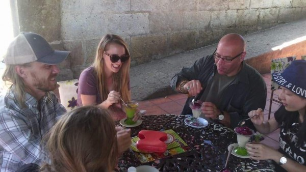](/wp-content/uploads/2016/06/FB_IMG_1459628729915.jpg) School outing\[/caption\]

### Tourist sites

Oaxaca is absolutely full of great ruins, craft markets, natural wonders, and museums. One of the coolest sites is Hierve El Agua, a mineral deposit that is left behind by dripping water. From afar, it looks almost exactly like a huge, flowing waterfall.

[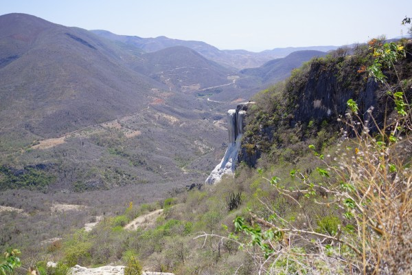](/wp-content/uploads/2016/06/DSC08354.jpg)

But, the actual water flow is minimal. On top, there is a beautiful set of bathing holes where the locals and tourists alike can gather to share their skin infections and pick up water borne illnesses.

[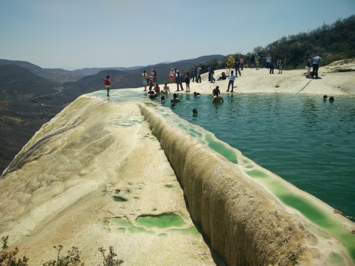](/wp-content/uploads/2016/06/IMG_20160403_140106.jpg)

The museums in Oaxaca were rivaled only, in my experience, by Mexico City. As always, I enjoyed taking photos of some especially interesting sculptures.

\[caption id="attachment_1006" align="aligncenter" width="450"\][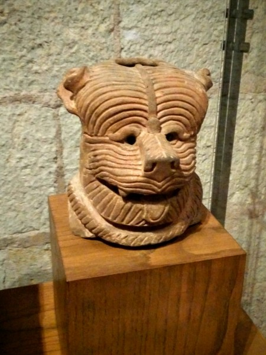](/wp-content/uploads/2016/06/IMG_20160406_143332.jpg) BearManPig? This cute bear-like creature is a wicked mesh from the terrifying warriors, sacrifices, and gods depicted in most prehispanic sculpture.\[/caption\]

\[caption id="attachment_1005" align="aligncenter" width="600"\][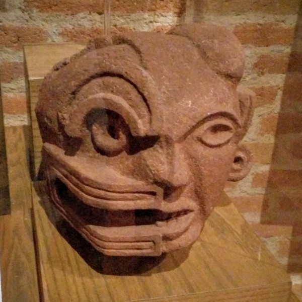](/wp-content/uploads/2016/06/IMG_20160406_143040.jpg) Any guesses as to what the two halves of this sculpture represent?\[/caption\]

I also visited the very impressive ruins of Monte Albán, a famous city and pyramid complex very close to present-day Oaxaca. It is mysterious to me why each successive Mexican civilization would abandon the cities of the previous one and effectively start over.

\[gallery type="rectangular" ids="1011,1010,1009,1008"\]

### Crafts

Oaxaca is world famous for its crafts. These include canvas paintings (often in a modern style and of world class quality), pottery (especially jet-black pottery made with a special glazing process ), woven textiles (typically using natural dyes ), and also my favorite: exquisitely painted, hand-carved wooden figurines.

The patterns painted on these figurines are so fine and complex that it can take literally months of full-time labor to complete even a moderately sized (e.g., 14 x 10 x 8 inch) figure. Interestingly, the artists have total creative control over the patterns, even if they are students. Although most draw on traditional Oaxacan symbols and motifs, each one is unique.

\[caption id="attachment_1012" align="aligncenter" width="600"\][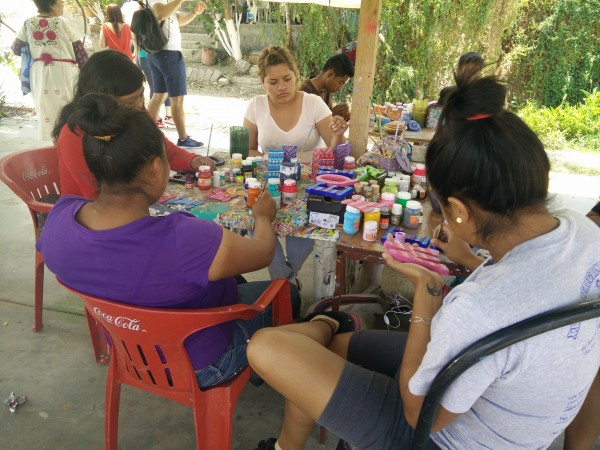](/wp-content/uploads/2016/06/IMG_20160416_140004.jpg) Students painting the wooden sculptures.\[/caption\]

\[caption id="attachment_1007" align="aligncenter" width="600"\][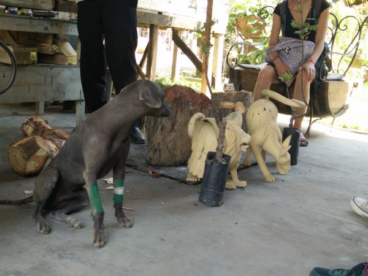](/wp-content/uploads/2016/06/IMG_20160413_152745.jpg) I love this photo of a hairless dog looking right at, essentially, a carving of himself.\[/caption\]

### Pueblos Mancomunados

Undoubtedly the best part of my time in Oaxaca was when my botanist friend from New Hampshire, Betsy, visited me on her way back from Phoenix. Although did spend time in the city of Oaxaca, our favorite part was visiting the Pueblos Mancomunados - a group of small, indigenous villages high in the cloud forests of the Sierra Norte mountains.

\[caption id="attachment_1016" align="aligncenter" width="600"\][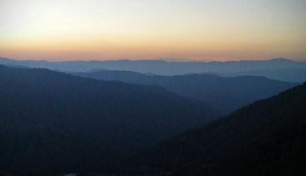](/wp-content/uploads/2016/06/IMG_20160408_195937.jpg) Sunset over the Sierra Nortes.\[/caption\]

\[caption id="attachment_1017" align="aligncenter" width="600"\][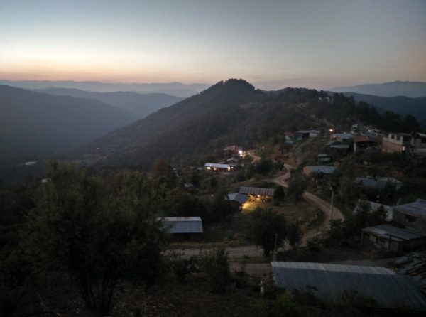](/wp-content/uploads/2016/06/IMG_20160408_200711.jpg) Dusk settles on one of the tiny Pueblos\[/caption\]

Or trip was organized through a tour agency set up by the Pueblos. As expected, Betsy totally nerded out with the guides on all of the exotic plants.

One of the activities, unbeknownst to me, was a traditional "relaxing bath" using stream water infused with local plants and herbs. People in the Pueblos truly rely on traditional herbal remedies, and have total confidence them. The old couple who administered the baths were some of the friendliest people I've ever met. And, while very strange, the baths were indeed relaxing and special.

[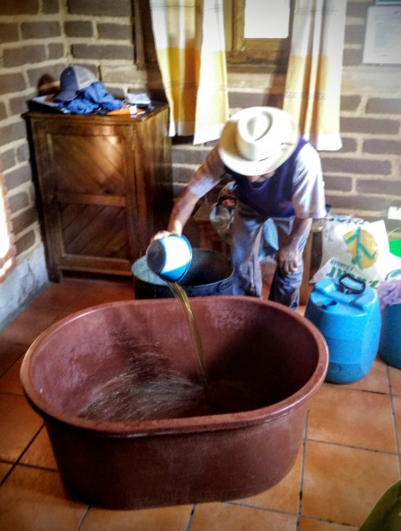](/wp-content/uploads/2016/06/IMG_20160407_182533.jpg)

Although we did many other organized activities, one of our favorites was an impromptu, unsanctioned hike where we happened upon an charming little trout farm. The family that lived there used the cold mountain stream water to breed and grow trout in huge cisterns.

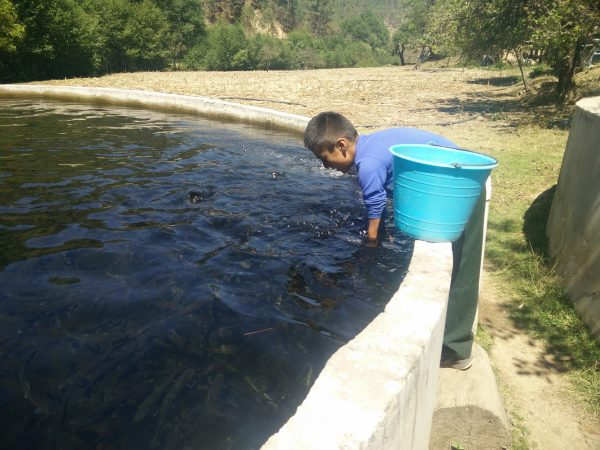

They also served the trout at a tiny, delicious restaurant, and the mother of the family just may have been the most friendly and gracious proprietor in the world. She and Betsy really hit it off.

[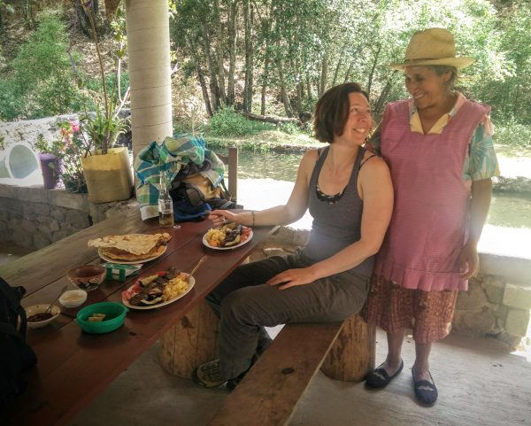](/wp-content/uploads/2016/06/IMG_20160409_152232.jpg)

I was sad to see Betsy go, but I was glad that we got to see and do so many awesome things in such a short amount of time.

[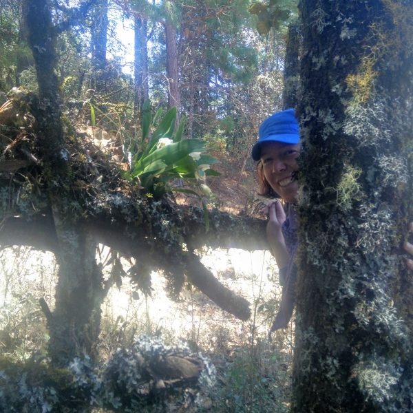](/wp-content/uploads/2016/06/IMG_20160407_132534.jpg)
