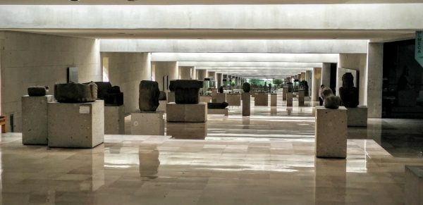
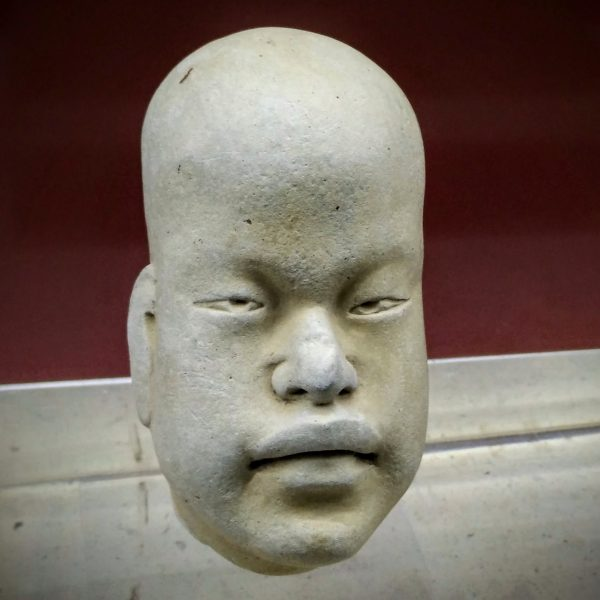
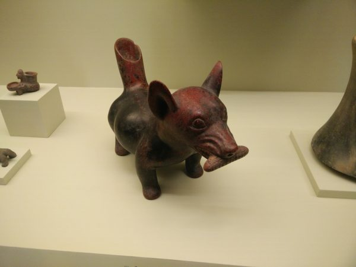
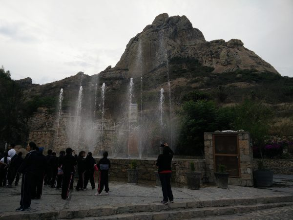

I was surprised to see how diverse Mexico is: geographically, socioeconomically, culturally, and even ethnically. In fact, the various indigenous communities in Mexico are [as genetically distinct as Europeans are from Southeast Asians.](http://www.sciencemag.org/news/2014/06/people-mexico-show-stunning-amount-genetic-diversity) Although it's only 20% the size of the US, it has about 40% as many people, 50% as much coastline. In short, there is plenty to see andto explore in Mexico. So, between my longer stays in San Poncho, Guanajuato, Mexico City, and Oaxaca, I made it a point to check some other points of interest.

### Xalapa, Veracruz

After Oaxaca, I took an ill-advised overnight bus to Veracruz, which I believe is the landing point of Christopher Columbus in Mexico. It's an economically important city with lots of history. But, as I woke to the site of the humid outside air condensing on the windows of the air conditioned bus, I realized that I was really in no mood to walk around this grimy port city, soaked in sweat and trying to avoid giardia.

Instead, I quickly headed to Xalapa, a beautiful and charming university town in the mountains of the state of Veracruz (and, coincidentally, the capital of the state). Xalapa had a lot going for it: the geography, weather, and vegetation were interesting. And, being a university town, there was plenty to do and see. I only spent one night there, but I was blown away by the quality of the anthropology museum in this relatively small city.

\[caption id="attachment_1023" align="aligncenter" width="600"\] The anthropology museum in the small city of Xalapa was built along the contours of the land, and looking down this terraced hallway was almost as impressive as the museum pieces themselves.\[/caption\]

As always, I was impressed by how contemporary some of the sculptures seemed.

\[caption id="attachment_1024" align="aligncenter" width="400"\] A fascinating, emotive sculpture, with facial features different from most other Mesoamerican sculptures.\[/caption\]

### Puebla

Puebla is the fourth largest metro area in Mexico, with about 3 million people. It is just a few hours from Mexico City, and I found it to be a much cleaner, well-planned, and well-managed alternative to Mexico City. (I hear that the rural areas in the *state* of Puebla, however, are extremely poor.) I stayed two nights in Puebla. The first night, I was literally the only person in my hostel--even the hostel workers didn't stay the night. And, combined with a vicious thunderstorm and some very austere decorations, it was one of the more ominous-feeling places I've ever stayed.

However, I had the fortune to fall in with a very nice group of people in Puebla, and we had a great time walking the city and visiting museums.

\[gallery type="rectangular" ids="1029,1026,1028"\]

\[caption id="attachment_1027" align="aligncenter" width="400"\] Another curiously timeless but culturally specific sculpture from a museum in Puebla: a dog (Chihuaua?) playing fetch with a corn cob.\[/caption\]

### Sierra Gorda

Karen was kind enough to help me celebrate my birthday with an awesome trip to the Sierra Gorda nature reserve in the Sierra Madre mountain range, north of Mexico City. After meeting up in Queretaro, we headed to to Bernal to hike the Peña de Bernal, a rock monolith that is by some measures the tallest in the world.

\[caption id="attachment_1030" align="aligncenter" width="600"\] Peña de Bernal, one of the tallest rock monoliths in the world.\[/caption\]

Afterwards, we headed to Jalpan where there was a great music festival and fair going on, and then Xilitla. The undisputed highlight here was visiting [Las Pozas](https://en.wikipedia.org/wiki/Las_Pozas), a sort of surrealist sculpture garden created by Edward James (a British poet and heir of some sort), between 1949 and 1984. The sculptures are the size small buildings, and feature strange pillars, staircases (some to nowhere), and a number of functional rooms as well. The rainforest is constantly advancing on the sculptures and threatening to engulf them, giving the place a bizarre Jurassic Park  sort of feeling.

\[gallery type="rectangular" ids="1035,1034,1032,1031,1036"\]
