This May, my little sister Emily and her long-term boyfriend Brian both came to visit me in Peru. We had been planning for a long time to do an international trip together, and after much research they suggested Peru and Machu Picchu. I was all in.

The classic way for tourists to get to Machu Picchu, which is a famous cluster of ruins high on a mountain top, is to take a multi-day hike following a historic trail called the Inca Trail.  Although I had heard great things about the Inca Trail, it had one fatal flaw. You have to plan ahead. In fact, reservations for the Inca Trail fill up as long as six months ahead of time. I struggle to have more than a six-week planning Horizon, and oftentimes 6 days or 6 minutes is more likely.

Consequently, I went to Cusco, the historic Inca capital that most tourists to use as a first staging area for Machu Picchu, a few days ahead of time to arrange things. We all decided to do an alternative trek, call the Salkantay, which is basically for people who didn't think far ahead enough to book the Inca Trail tours. However, although it is less historic, it is more impressive in its natural beauty, and we were all pretty happy with the outcome. During this time, I was markedly less successful in my decision making with regards to food. Namely, I had a delicious strawberry and yogurt smoothie one night, forgetting that strawberries actually just sit on the ground and are virtually impossible to totally clean. Consequently, I spent the next two to three days in bed and was violently ill.

I was just starting to recover around the time that Emily and Brian showed up. We took one day to see the city of Cuzco. It really is an amazing city. One of the most striking features is the ancient Incan walls that seemed to almost arbitrarily jut out of many contemporary buildings. The walls are famous for their craftsmanship. In fact, the giant stones fit together so tightly that you typically cannot even fit a piece of paper between them. Nobody knows how they did it.

Soon afterwards, we started the trek. The natural beauty of the entire trip was astounding. One of the first things we saw was a glacier looming in the distance. With a bit more walking, we entered another valley and were able to see Mount Salkantay.

 

\[caption id="attachment\_1046" align="aligncenter" width="600"\][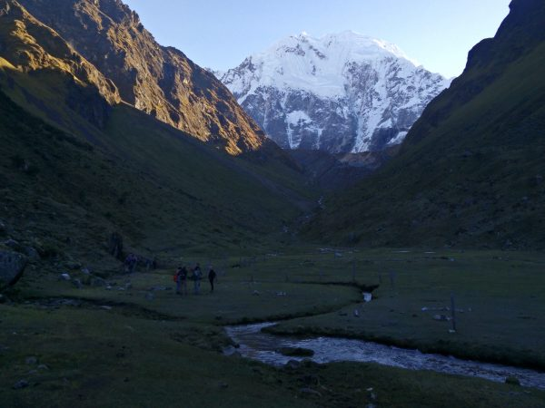](http://www.rdchambers.net/wp-content/uploads/2016/06/IMG_20160516_070551.jpg) Mt. Salkantay\[/caption\]

Even from a distance, it is easy to imagine the sheer brutality of the weather on the 20,574-ft mountain.

To cross the Continental Divide, which separates waters flowing towards the Pacific, from Waters flowing via the Amazon to the Atlantic, we took a pass that was 15200 feet--taller than any mountain in the continental United States. We could definitely feel the altitude. But, our entire group made it through without incident.

\[caption id="attachment\_1042" align="aligncenter" width="600"\][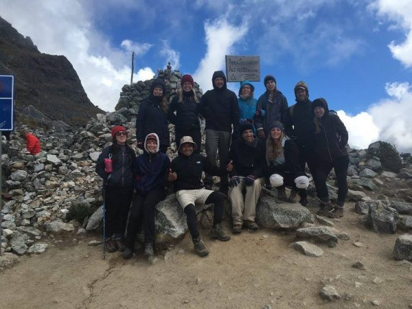](http://www.rdchambers.net/wp-content/uploads/2016/06/13247709_10206409629427090_3754679180631822008_o.jpg) Our whole trekking group, crossing the continental divide.\[/caption\]

Of course, the only reason that we were able to do a trek of this magnitude without any serious conditioning and without special equipment, is that all of the hard work was done by the employees of the touring company. In fact, when we arrived in camp, our tents would already be set up and our sleeping mats would be inflated. In the morning, we would head to breakfast, which was amazing and fully prepared. By the time we were done with breakfast, our tents would be broken down and packed for us, and we would head off on the trail. At some point, the porters would pass us with the horses that they used to carry our gear. At around noon, we would find them in either packable dining tent, or in some type of hut along the way, having prepared an amazing multi course lunch for us. Again, we would head off while they did the dishes, packed up the kitchen, passed us once again on the trail, and got into camp to set up our tents and cook another amazing multi-course dinner. I was absolutely astounded at the quality of the food, as well as the fact that these guys could produce that kind of food while still attending to all of our other needs. It was a little bit strange at first, but I have to say you get used to it quickly.

\[caption id="attachment\_1045" align="aligncenter" width="600"\]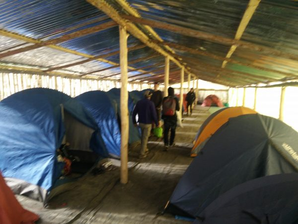 Our tents set up for us by the support staff.\[/caption\]

 

\[caption id="attachment\_1040" align="aligncenter" width="600"\][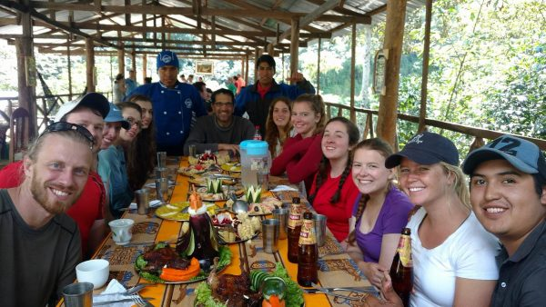](http://www.rdchambers.net/wp-content/uploads/2016/06/13235028_1181614211881310_1535131046_o.jpg) One of our amazing meals. The chefs at this company completed a full three years of wilderness chef training to be able prepare feasts of this magnitude.\[/caption\]

 

\[caption id="attachment\_1041" align="aligncenter" width="600"\][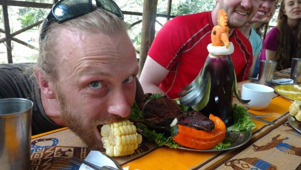](http://www.rdchambers.net/wp-content/uploads/2016/06/13235077_1181614208547977_648146812_o.jpg) Right: beautiful food art (!) made of an eggplant and a carrot. Center: roasted guinea pig (a traditional Peruvian meat) with a pepper in its mouth. Left: foolish tourist impersonating the roast guinea pig.\[/caption\]

After 4 days of trekking, it was time to take a famous tourist train the last few miles towards Machu Picchu. Certain people in our group took it as an opportunity to catch up on sleep.

[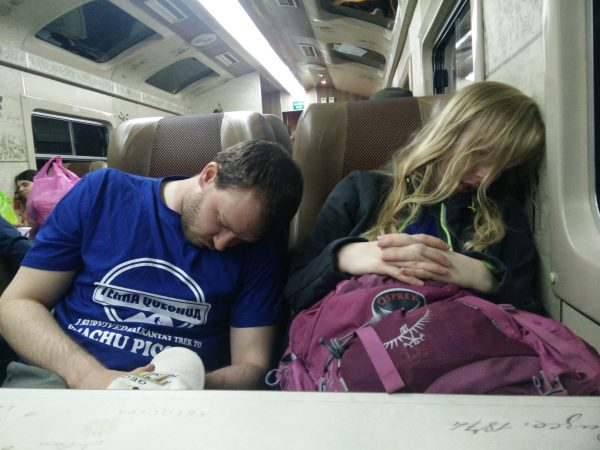](http://www.rdchambers.net/wp-content/uploads/2016/06/IMG_20160518_193117.jpg)

After a night in Aguas Calientes, the tourist town that is immediately next to ancient site of Machu Picchu, we took a bus up to the extremely crowded site itself.

Although the majority of Peru seemed to be quite heavy on tourism, Machu Picchu itself was like being at a ancient Inca tourist site, in the USA. The number of American tourists was incredible. In fact, I hear that if you for some reason were to pay for the entrance fee in the local currency, which is Peruvian Soles, they would give you your change in American dollars. And, it goes without saying that US dollars are accepted at all tourist establishments. It blows my mind that people can travel to another country without using the local currency.

However, all of that was quickly forgotten inside of Machu Picchu. The quality of the stonework, and the incredible degree to which the site has been preserved, are astounding. And, the site's location so far above the surrounding valley added even more to its mystical atmosphere. It was easy to see why Machu Picchu is one of the most well-known tourist sites on Earth.

 

[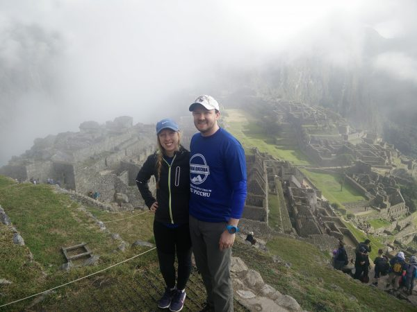](http://www.rdchambers.net/wp-content/uploads/2016/06/IMG_20160518_075910.jpg)[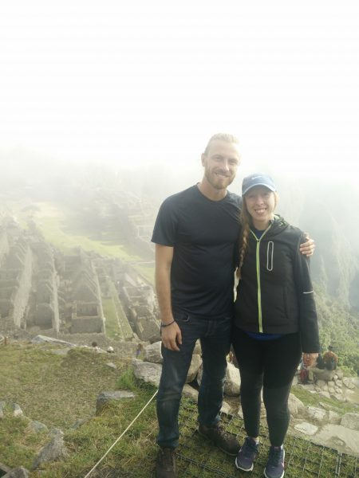](http://www.rdchambers.net/wp-content/uploads/2016/06/IMG_20160518_075844_1.jpg)

After Machu Picchu, we made our way to Lima, the capital of Peru. On the plane flight there, Emily and Brian managed to catch a little bit more shut-eye.

 

[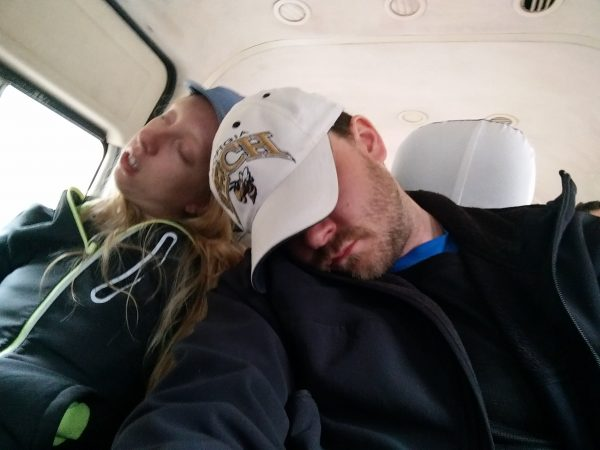](http://www.rdchambers.net/wp-content/uploads/2016/06/IMG_20160515_072355.jpg)

I was glad that Emily and Brian got to experience a less touristy side of Peru in Lima. At one point, Emily was swamped by a group of schoolchildren who wanted her autograph.

[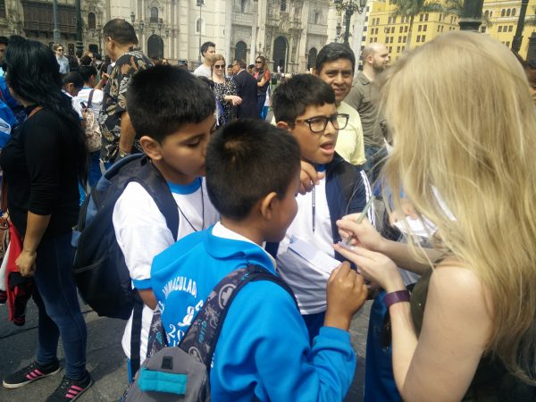](http://www.rdchambers.net/wp-content/uploads/2016/06/IMG_20160520_115104.jpg)

We ate like royalty, especially of the fresh Ceviche that Peru is famous for, and we visited historic sites around the city, including a museum that specialized in erotic Incan sculptures. And boy, did they have imaginations.

We also visited a huge fountain show in Lima, allegedly one of the best in the world. My theory is that the locals love fountains because they live in such a dry desert. I made the photo below thinking that it would be funny if I looked like I was drinking from one of the fountains, only to quickly realize that I had just sprayed a bunch of water of unknown origin into my mouth, in a country that is famous for water-borne illnesses.

[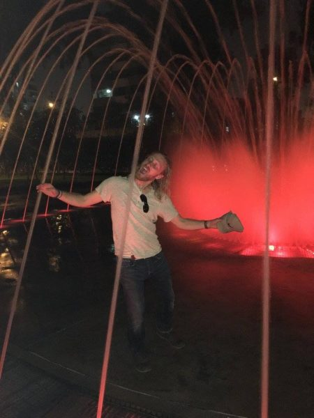](http://www.rdchambers.net/wp-content/uploads/2016/06/13248473_10206409618866826_7160770413352628120_o.jpg)

Emily, Brian, and I squeezed a lot of activity into under 2 weeks. It was tiring, but awesome at the same time. And it was great to have such extended time to spend with both of them.
