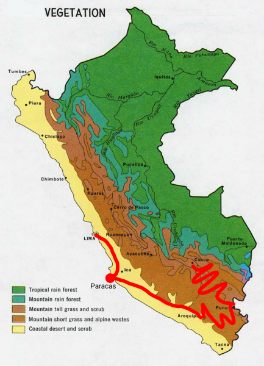
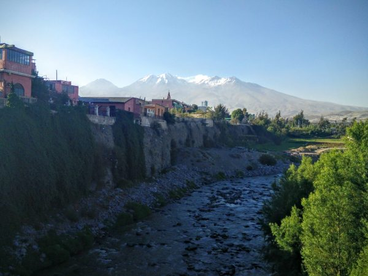
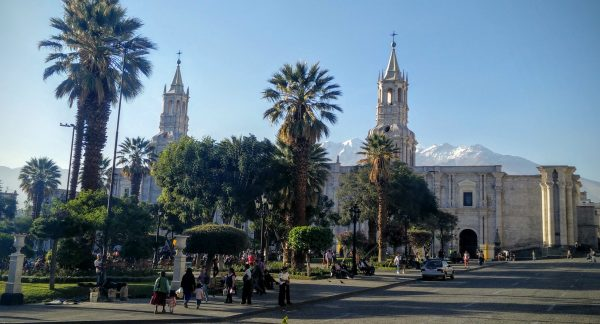

Before meeting my sister Emily in Cusco, I took about 10 days to do a whirlwind tour of coastal and southern Peru involving lots of night buses.

The geography of Peru is amazing. The Andes run in a thin strip down the center of the country, and with an _average_ height of 13,000 feet, they create a huge weather barrier. However, unlike in most countries, in Peru it is the _coastal_ side that is dry - one of the driest deserts on earth, in fact. The interior side, on the other hand, is incredibly wet and inaccessible. Much of it is part of the Amazon rain forest, and it includes the source of the Amazon river.

The image below shows a bit of this diversity. Superimposed here is my 10-day path from Lima (the capital), to Paracas, and then to Arequipa, Puno (Lake Titicaca), and finally Cusco.

\[caption id="attachment\_1095" align="aligncenter" width="433"\] Peru, on the northwest coast of South America, consists of a very serious coastal desert on the west coast, the Amazon rainforest on the east, and the Andes mountains forming a barrier in between.\[/caption\]

### Paracas (Las Islas Ballistas)

Just offshore from the tiny coastal resort town of Paracas, which is situated in a dry and especially barren part of Peru's coastal desert, are the uninhabited Islas Ballistas. The islands are a critical home and nesting ground for many bird species, as well as for thousands of sea lions.

Before the advent of industrially produced nitrogen-based fertilizers, the islands were also an important source of guano (bird droppings), an excellent fertilizer used in the area since prehispanic times.

Nowadays, the islands are carefully protected, and are a success story for economically and environmentally sustainable ecotourism in Peru.

I had always been fascinated by this type of otherworldly ecosystem on nature documentaries, and seeing it so close was a highlight of my travel in Latin America.

\[gallery type="rectangular" ids="1061,1060,1059,1058,1057,1056"\]

### Arequipa

Although Arequipa is Peru's second-largest city, it is _much_ smaller than the capital city of Lima (1 million vs. 10 million people). That might be one reason why it felt so much more compact and livable. One of my favorite aspects of Arequipa were the nearby rivers and the three ~19,000 ft volcanoes that overlook the city. 

The main square and cathedral were also gorgeous, especially silhouetted against the magnificent terrain.

### Arequipa to Puno

One reason that Arequipa is so well-established on the tourist circuit is its proximity to phenomenal wilderness excursions. Even beyond the magnificent volcanoes, there is Colca Canyon, one of the deepest in the world (twice as deep as the grand canyon, though again this is cherry-picking a single metric of size) and home to many Andean condors--magnificent birds with a 10 ft+ wingspan (larger even than the California condor).

We continued towards Puno via magnificent valleys, terraced for farming over millenia by the Incas and other indigenous peoples.

\[gallery type="rectangular" ids="1064,1065,1066,1067,1068"\]

### Puno (Lake Titicaca)

Puno is the largest Peruvian city on Lake Titicaca, which is itself the highest navigable lake in the world (12,500 ft), the largest lake in South America, and part of the border between Peru and Bolivia. It is a stunning, beautiful lake, and although I only had a single day to spend there, I did manage to visit the famous floating islands of the Uru people.

The Uru originally created these islands in prehispanic times to avoid neighboring aggressive tribes. They construct the islands, as well as their houses and many of their tools, out of reeds which also grow in the lake. Consequently, the island are constantly decomposing and need to be rebuilt once every year or two. The islands are truly free-floating, but are anchored to the lake floor via ropes. It is an unusual existence, and one that nowadays seems to be predicated entirely on tourism.

Still, I found the visit to be fascinating, and the local people to be incredibly friendly and genuine, despite the daily onslaught of ogling tourists.

\[gallery type="rectangular" ids="1069,1070,1071,1072"\]

 

After Puno, I continued on through the beautiful Peruvian highlands to Cusco, where I met my sister Emily and her boyfriend Brian for a magnificent trip to Macchu Picchu (detailed in another blog post).
