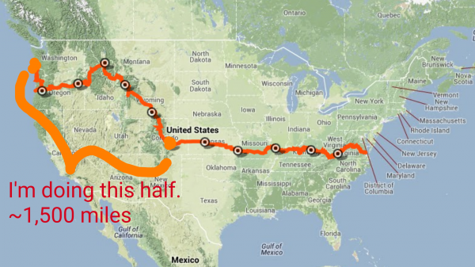
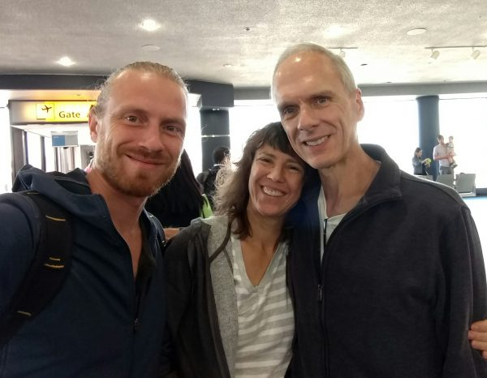
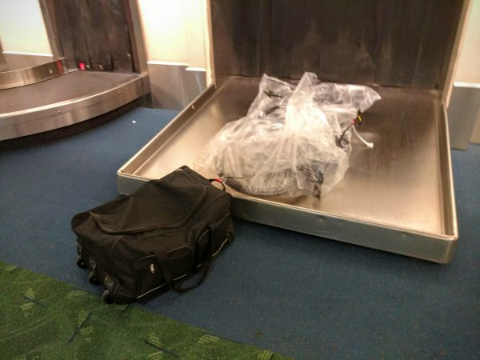
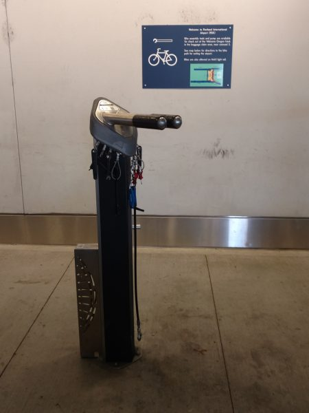
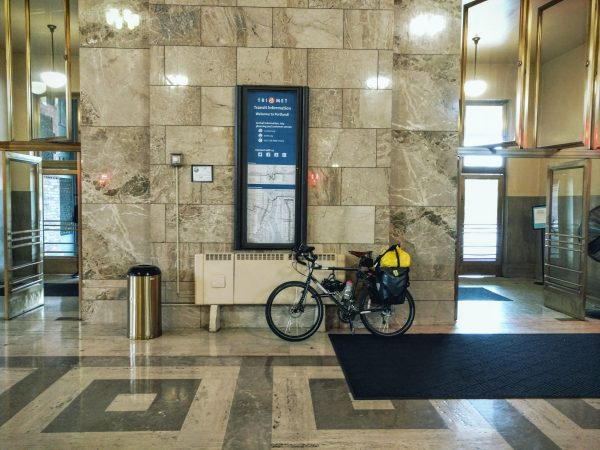
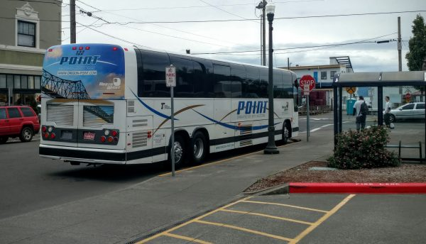
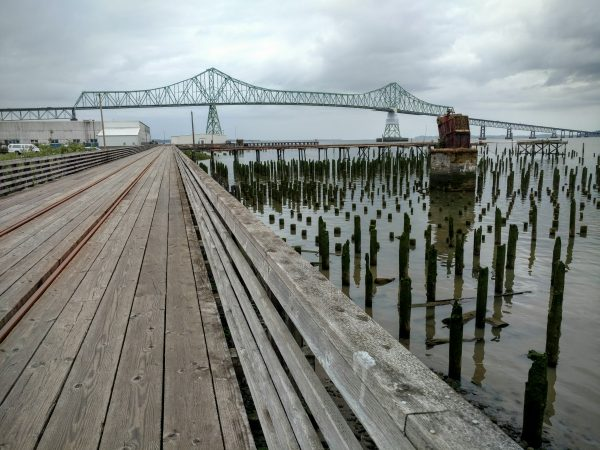
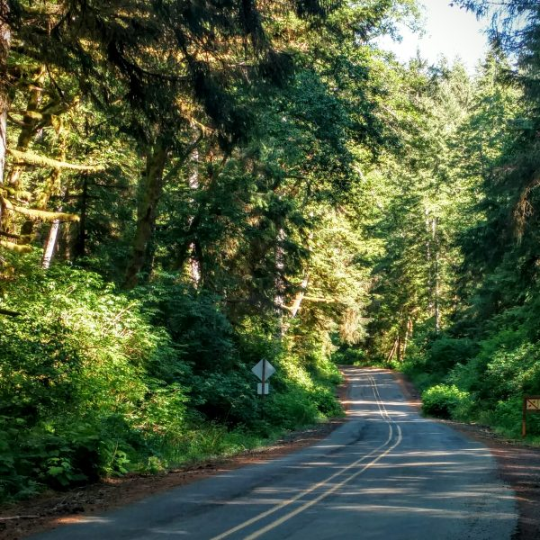

After spending several awesome months enjoying Latin America, it is now summertime in the US, and I definitely don't want to be below the equator during our limited good weather. Also, I have a number of commitments in the US this summer. So, I decided to immerse myself in the American West with a 1,500-2,000 mile trip on the TransAmerica bike route.

### The Transam

The [TransAmerica Trail,](https://www.adventurecycling.org/routes-and-maps/adventure-cycling-route-network/transamerica-trail/) or the 'transam', is a bike route administered by the [Adventure Cycling Association](https://www.adventurecycling.org/), a small nonprofit in Missoula, Montana. It's the oldest and most well-known off the many cross-country bike routes (although the ACA has many other cool routes, check out their website to find one near you.) The route was initially laid out for the Bikecentennial race in 1976, which celebrated the bicentennial of the founding of the USA. It seemed like the perfect route for me, since I've always been intrigued by the mountains of the American West, and since my trip in Europe demonstrated to me that my preferred routes are the ones that are desolate and rural.

The whole route is about 4,000 miles. But, I'll be damned if I'm going to ride 1,500 miles across the great plains with a headwind reeking of cow shit, so I'm going to stop near the midpoint of Pueblo, Colorado, and head over to Boulder, CO where my next major activity starts on July 19. I'll also skip a bit of the trail due to time constraints, giving me a total mileage of around 1,500 over the course of ~30 days. 50 miles a day seems just about right, since I've done virtually zero training for the ride.

### Welcome to Newark Airport, Please Go #$%@ Yourself.

As I had in the past, I used a clear,disposable [CTC bike bag](http://www.wiggle.com/ctc-cycling-uk-plastic-bike-bag/) to prepare my bike for the airlines. The idea is that the baggage handlers see that your baggage is indeed a bike, and consequently they refrain from tossing it off cliffs and packing it below crates filled with elephants, as is their custom. The CTC site has hundreds of positive reviews for these bags, and I have yet to find a review that mentions the bag not being accepted by an airline.

Except for this one. As I approached the Southwest Airlines counter in Newark, a venomous looking middle-aged man began shrieking "He can't take that! He can't take that!". Clearly, nobody else cared, and he wasn't even checking me in. However, his unusual passion for ruining my day prevailed over the attitude of the other Newark Airport employees, whose spiteful malevolence is of course usually held in check by their laziness. Consequently, even after getting a supervisor involved, it was clear that I was not getting on the flight. What was most enraging was the *pleasure* that these people took in pointing out the failings of my bicycle bag. They even claimed that this was "for my own protection", when I clearly was completely willing to take on the risk of bicycle damage. Southwest's policy is that I simply need to sign a liability waiver to use a soft-side case. I'm sure that with virtually any other Southwest location, I would have gotten on the plane without a hitch

Alas, I gave up, cancelled my ticket, and was worried that my trip was over before it started.

Luckily, a fortuitous sequence of events transpired. First, I was able to get a next-day ticket on Virgin America for only a few dollars more than the Southwest ticket. The Virgin ticket agent assured me that the bike bag was no problem, and I actually bought the ticket right at the counter - just like the olden days!

Secondly, my Dad and my stepmother Suzie happened to be staying at a swanky boutique motel nearby. So, I was able to use the free hotel shuttle back and forth (getting a bike in a taxi is not straightforward), and stay with them for the night. It was amazing!

\[caption id="attachment_1103" align="aligncenter" width="600"\] Dad and Suzie in the airport. We randomly ended up with flights that left within an hour of each other from the same terminal.\[/caption\]

### Everything Gets Better The Further You Are From Newark

I arrived in the Portland airport safe and sound, along with my bike, which suffered only a broken spoke and handlebar bag mount.

\[caption id="attachment_1101" align="aligncenter" width="600"\] My bike arriving in its CTC bike bag, and my bike panniers all loaded together in a big cheap suitcase (to save on extra bag fees).\[/caption\]

By the way, I know that this is common knowledge, but it is just fantastic to bike in Portland. Check out this *bicycle reassembly station* at the Portland airport, complete with a bike stand and tons of tools.

\[caption id="attachment_1102" align="aligncenter" width="450"\] Bicycle reassembly station in Portland Airport\[/caption\]

I used the awesome Portland light rail to get to my expensive yet decrepit motel populated by meth-heads and homeless people (how do these people always afford to live in these hotels?!), which by the way did not have hot water. I reassembled the bike (no problems there, luckily) and biked to the historic Union Station early in the morning.

I took the awesome [Northwest Point](http://www.oregon-point.com/nw_point.php) shuttle from Portland to Astoria. They let me take my bike fully assembled in the luggage compartment for $5, God bless them. (Greyhound and most Amtrak routes make you box the bike, and in most cases won't sell you the box, which is terribly inconvenient.)

After navigating the mess of mentally ill beach bums who seem to inhabit all coastal cities with good bus service, I was off and biking! I immediately learned that the Transam is not a signed route, which for some reason was surprising to me. It basically just piggybacks on existing automobile infrastructure. However, with a combination of my cell phone and the maps, it is easy to navigate.

\[caption id="attachment_1106" align="aligncenter" width="600"\] Astoria, Oregon: start of the Transam at the mouth of the Columbia River. The pilings are from long-gone factories, and the bike route manages to combine longitudinally-running wooden slats with an actual railroad track, just to ensure that you fall and suffer wood splinters from head to toe.\[/caption\]

### The Oregon Coast

The route down the Oregon coast was a combination of beautiful and horrible.

The beautiful part was the shocking, unique, awe-inspiring scenery of green, jutting cliffs overlooking the ocean. I also enjoyed checking out the great restaurants at cool beach towns.

The terrible part was (1) the traffic (all of the Pacific Coast suffers from this, and I don't know how people who ride the whole coast can deal with it), and (2) the weather. It absolutely poured rain several of the days, and temperatures were in the upper 30's to mid-40's. Let me tell you: when you're soaking wet in temperatures barely above freezing, with frigid winds coming off the ocean at 40+ mph, you're going to really regret that your only rain gear is a poncho. It just doesn't cut it.

The temperatures and road conditions were so bad that, after climbing the uphill sections by bike (which always warms you up), I actually had to continue pedaling hard on the downhills, while using the brakes the entire way to slow me down, just to keep warm while staying at a safe speed. A few times, the wind was so bad that I (and even other cyclists without ridiculous bike ponchos) had to get off the bikes and walk them for fear of being blown into traffic or off of the cliffs.

\[gallery type="rectangular" ids="1107,1108,1109,1110"\]

### Cutting Inland

After a few days on the coast, the path began to cut inland across the coastal range. Since each mountain range tends to decrease the amount of rain reaching inland, I was happy for the change. And, as I veered off the 101 onto a barely-traveled back road that meandered through the coastal foothills into the thick verdant forests, the weather began to clear up, just for a few hours, and I knew that this trip was going to have good things in store for me.

\[caption id="attachment_1111" align="aligncenter" width="600"\] Cutting inland from the Oregon coast, across the coastal range towards Salem, Ore.\[/caption\]
