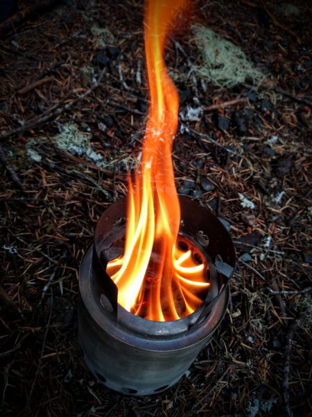
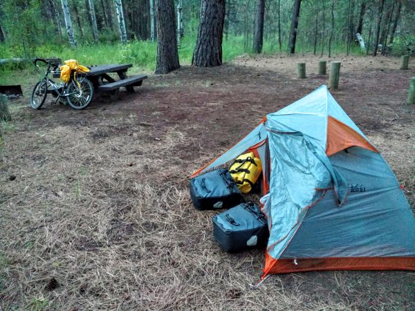

Over the past year, I've really fallen in love with certain aspects of bike touring. I love that it's challenging, and unpredictable, and that the road and the environment can change so drastically through the course of a day. So, I decided to write up in more detail than usual a single day, which for me encapsulates the kinds of challenges and experiences that make a trip like this worthwhile for me.

The day started out in a small RV park that allowed bicyclists to camp (and use the showers and coin-op laundry) for $10. Like most of the bicyclist-friendly camping spots on the trail, the owners seemed to do it out of real generosity and heartfelt kindness for touring cyclists. For instance, at many campsites, an single car camping spot is north of $50, while a bicyclist can camp for between $7 and $12.

As usual, I cycled a few miles to a restaurant and took a look at the map over an extremely heavy breakfast. It was clear that I would be gaining around 4,000 feet in elevation. The pass I needed to take was called McKenzie Pass, and it is a gateway from the lush Willamette valley (home to Salem, Corvalis, and Eugene), over the Cascades mountain range, to the much drier Columbia Plateau (home to Bend, Ore.). The pass is famous for its scenic lava flows, and also for its ugly weather.

4,000 ft is by far the largest single elevation gain I had done in a day, and I was worried because I had been having problems with my knees (a consequence of not training for the trip!). Furthermore, camping at the top of the pass did not seem very comfortable or appealing.

As I was pumping the waitress and other staff at the restaurant for more information, they related an interesting story. A few weeks back, a group of cycle tourists from England had stopped by the restaurant during some hot weather. After lunch, when the group went to grab their bikes, a young woman's bike had been stolen. Luckily, the woman had kept her wallet with her, but literally everything else she was not wearing on that hot day had been stolen, in this isolated town, in another country, thousands of miles from home.

Luckily, the town was aghast at this unheard-of crime, and they pulled together to make things right. The local inn owner fed and boarded the young woman for several days at no cost, and the community launched a Facebook campaign to find the bike.

The bike was never found (the local theory is that the homeless 'hill people' who live in the national forest had stolen it), but somehow her other belongings were located. Even more impressively, a community member donated enough money to buy her a new bike (these things are not cheap!), and shipped everything to her in Montana so she could rejoin her group.

It was a great, heartwarming story that reminded me to always lock up my bike, no matter how innocent the town seems.

I continued on from the restaurant, stopping at a convenience store and later at the ranger station to get more information about the pass. Apparently, it was still closed to vehicular traffic (it opens each year on a specific date when the risk of snow becomes sufficienly small), but it was already open to cyclists. The ranger said that snow was still possible, but I chose to cast my lot with the weather rather than with the amateur RV drivers on the busy alternate route.

The road climbed and climbed, interminably, and I knew to simply keep it in the granny gear and not over-exert myself too early. In about 20 miles, I passed a gate that closed the road to cars. I started to breath easier knowing that, for once, the only thing that would run me over would be a large mammal.

Continuing higher, the weather became more brisk. In fact, it had been cold (in the 40s or sometimes even lower) and rainy for the entire week since I'd arrived at the Oregon Coast. The rain was never consistent, but it was too unpredictable to ever remove my comical yellow bike poncho.

[However, around 3,500 ft, I began to notice small patches of snow at the edge of the road.](http://www.rdchambers.net/wp-content/uploads/2016/07/IMG_20160614_165444041.jpg)

This surprised me, since 3,500 isn't that awfully high, and it was mid-June. However, as the rain started to let up a bit, I decided to revive my flagging energy by stopping and cooking a hot meal. I had been sweating going up the hill, but I was soaking wet and temperatures were in the high 30's, so I immediately put on two layers of pants and a down jacket.

Because I insist on trying new and different things for absolutely no reason, I had brought a wood-burning stove on the trip. It works well in dry weather, but I had a hell of  a time cooking my meal in this quasi-rainforest in 35 degree weather and driving wind.  Still, there is something about the ambiance a wood fire.

Lunch took about an hour, mostly because of my poor choice in camping stove. Afterwards, I took off most of my warm clothing and got biking again, immediately heating back up.

However, the rain continued, and the snow depth increased with every switchback.

As I felt I was nearing the top of the mountain, the rain turned to sleet, and then to giant wet snow flakes. The wind picked up noticeably. 

At this point, I began wondering whether I would be able to clear the pass before dark. If the road were to become covered in snow, I'd have to stop. Furthermore, I was getting absolutely soaked and really cold. I had three options. (1) I could turn back and drop some elevation, which I really didn't want to do; (2) I could try to camp near the pass, which would be cold and windy but at least would make for an easy descent in the morning, or (3) I could try to clear the pass and hope that by getting to the drier side of the mountain range and dropping some elevation, I could spend a much more comfortable night camping. But, if this went badly, I could get caught as the sun set on the midst exposed part of the ridge.

I decided against (1), and figured that I might as well press on. Soon, I began to encounter the incredible lava fields that McKenzie pass is known for. The steady wind caused the wet dusting of snow to cling to just one side of the small rocky nubs, creating a striking textured effect.

The further I continued, the stronger the snow and sleet became. Luckily, I had a magnificent tailwind, and as long as I kept pedaling hard I could keep my body temperature up. I began to feel confident that I'd clear the pass, and instead of worrying I started to enjoy the incredible sensation of being utterly alone in this enormous, otherwordly winter wonderland.

As cold as I was, I couldn't resist stopping to snap a few photos as I traversed the ~5-10 miles of exposed ridge at the top of the pass. I could not shake the overwhelming feeling of being alone in another world that was transformed by this unusual and beautiful snowstorm, and furthermore, of having earned it by taking the risk to climb up through the pass that day.

\[gallery type="rectangular" ids="1119,1121,1120,1133"\]

Around 8pm, just as the sky was beginning to darken, I began my descent of the pass. I was actually very worried about the descent, since I wouldn't be pedaling enough to generate bodyheat, and my high speed  and soaked clothing would cause the wind to sap my bodyheat even faster. Consequently, I put on a couple of extra layers, reserving my warmest clothes in my waterproof panniers (if they got wet and my bike broke down, I really would be in trouble), and I resolved to pedal hard the whole way down, even though it meant riding against my brakes (which felt ridiculous).

But, it worked. Within about 15 minutes, I had dropped a ton of elevation. I had cleared the rainstorm, the temperature had risen from freezing to probably the mid 50's, and I was mostly dried out.

I pulled into a campground, set up my tent, and was asleep within a few minutes.

The next day, as I headed towards Bend, Oregon to visit my friend Rob Little, the landscape had changed tremendously from what I'd experienced in the Willamete valley. I pulled off the road and looked nostalgically at McKenzie Pass and the surrounding snow-covered mountains in the distance.

Then, hopping back on the bike, I continued onwards to begin discovering the natural beauty and local culture of Eastern Oregon.

