After the frigid and rainy Oregon Coast, and then the memorable climb over the Cascades through McKenzie Pass, I entered Central and Eastern Oregon and things began to get easier. For the most part.

### Eastern Oregon

After visiting my college friend Rob Little in Bend (he's hard at work on his outdoor-gear subscription service, [Cairn](http://www.getcairn.com/)), I continued Northeast across the state, towards the blue mountains.

Just before the going started getting steep, I passed through Prineville, Oregon. Prineville is an old-school, conservative, agriculture- and lumber-oriented town that is down-on-its-luck and struggling with unemployment (up to 17% during the recession). In recent years, however, Prineville has used deep tax breaks to convince Facebook, Apple, and Google to build multi-billion-dollar data centers.

\[caption id="attachment\_1205" align="aligncenter" width="600"\][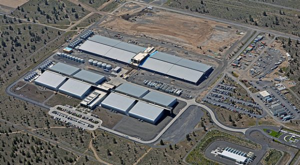](http://www.rdchambers.net/wp-content/uploads/2016/08/prineville_datacenters.jpg) An aerial image (not mine!) of one of Apple's Prineville, OR datacenters.\[/caption\]

Consequently, hotels and campsites are full of itinerant electricians and construction workers. It was a strange to see these giant physical manifestations of the internet economy built in a community where most people probably don't have a smartphone.

I was happy to leave Prineville to head deeper into the mountains. I had clearly left the moist Oregon Coast behind for the Wild West landscape of Eastern Oregon.

\[caption id="attachment\_1140" align="aligncenter" width="600"\]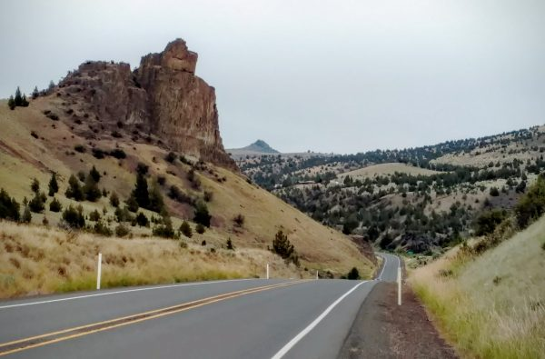 The climate got drier and more Wild-West as I went deeper into Eastern Oregon.\[/caption\]

Soon, after passing a night in Mitchell (an interesting little town that seems to have attracted a little bit of the Portland micro-brew and music-festival vibe into this otherwise old-fashioned area), I started heading up a long, steep incline that I knew would take most of my morning. That morning was supposed to be the last of the intensely rainy, windy, and cold weather that had haunted me since the Coast. However, I didn't have time to wait for it to pass, so I decided to brave the storm.

About halfway up the ~2,500 vertical foot pass, I pulled over to rest and heard air hissing from my back tire. Just the, the wind and rain began to pick up. Undaunted, I began fixing the flat in the pouring rain just as two retired gentlemen passed, going in the same direction as me. They commiserated with me over my bad luck, snapped the photo below of me in my German rain poncho with my newly-patched tube, and continued up the incline.

 

\[caption id="attachment\_1143" align="aligncenter" width="600"\][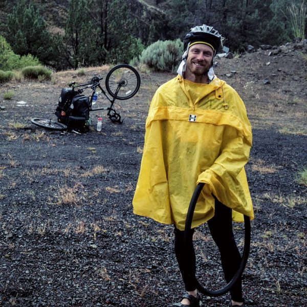](http://www.rdchambers.net/wp-content/uploads/2016/07/IMG_0747.jpg) This is me smiling in the rain and frigid weather before I realized that my bike repair equipment was, itself, broken.\[/caption\]

Unfortunately, disaster soon struck. First, my patch didn't take, probably because I couldn't keep it dry or clean in the pouring rain. That was disappointing, because removing and reinstalling the tire and tube really sucks when it's slippery. But, I wasn't too despondent as I removed the tube and replaced it with a fresh one (just to be safe). Then, as I began to reinflate the tire, I realized that the seals in my air pump (which I hadn't used for about 8 months) were shot. I couldn't get the tire up over a couple of PSI. I pumped feverishly for about 30 minutes, maybe hoping that I could get enough pressure to ride, or maybe just trying to keep warm in the hypothermic weather. It was useless.

As I sat in the pouring rain, shivering, I was at a complete loss as to what to do. I couldn't ride the bike downhill several miles back to Mitchell without a working tire. And even if I did, or if I managed to hitch back, there wasn't a bike shop there. And, I couldn't continue. With no good options, I decided to simply sit there, looking pathetic and miserable, until my luck changed.

It turns out this was the right decision. In about half an hour, the weather finally passed, the sun appeared, and my gear started to dry out. Before long, a bike tourist passed in the other direction. He was of the high-performance type, doing upwards of 120 miles a day. I screamed bloody murder to make sure he stopped, and sure enough he pulled out a beautiful air pump. I pumped up my tire and, within seconds, my bike was fixed and I was happy and moving again.

It was a good lesson that sometimes, you just have to calm down and let events work themselves out at their own pace.

As I got further into Eastern Oregon, the population thinned out and the land took on a great wild-west vibe. One of the many random points of interest was this shoe tree, which I must say was the most prolific shoe tree I've ever seen.

 

[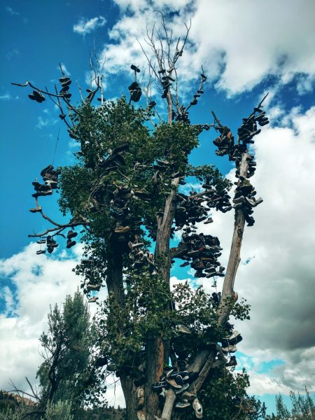](http://www.rdchambers.net/wp-content/uploads/2016/07/IMG_20160618_161003336_HDR.jpg)

[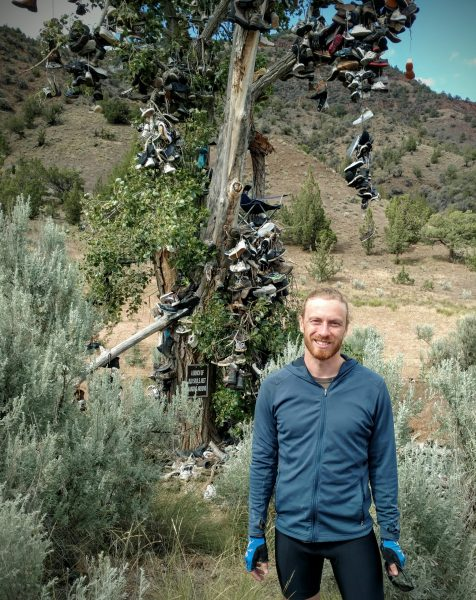](http://www.rdchambers.net/wp-content/uploads/2016/07/IMG_20160618_161115588.jpg)

But, even as the land grew drier, you never knew when you'd round a corner into a verdant valley.

\[caption id="attachment\_1147" align="aligncenter" width="600"\][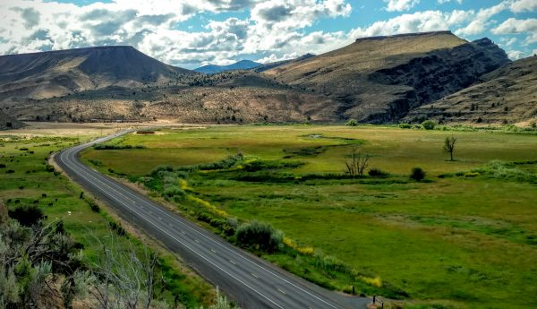](http://www.rdchambers.net/wp-content/uploads/2016/07/IMG_20160618_174259446_HDR.jpg) An unexpectedly lush valley in Eastern Oregon.\[/caption\]

Soon after my flat tire meltdown,  I ended up linking back up with Len and Don, the two cyclists who had passed me before I realized that my tire pump was broken. We ended up biking and traveling together for over a week.

\[gallery type="rectangular" ids="1144,1145,1153"\]

Don, among other quirks, had an intense but surprisingly well-researched fear of wild animals. There were scarcely any species that I could mention but that Don could name off some way that the animal had threatened to kill a cyclist or hiker. Of course, matters were not helped when we stopped at a local sporting goods and hunting shop and saw photos of like this:

\[caption id="attachment\_1149" align="aligncenter" width="450"\][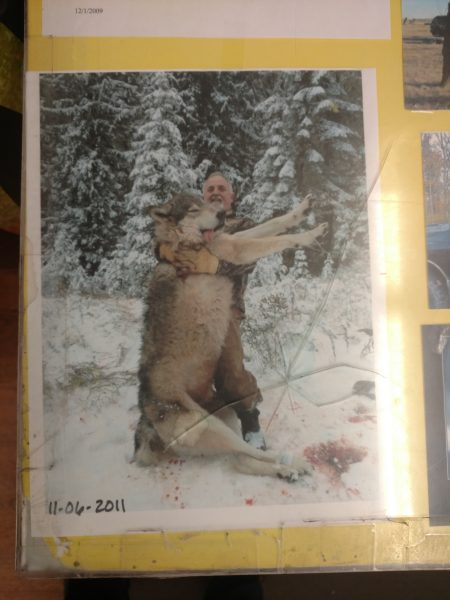](http://www.rdchambers.net/wp-content/uploads/2016/07/IMG_20160626_170610761.jpg) Is that a _dire wolf_?\[/caption\]

The attitude of the locals to wolves was unambiguous; they _hated_ them. They claimed that the wolves killed and maimed domesticated and wild animals for the sheer joy of it, and that they were a threat to children. The motto when you see a wolf in this area is, apparently, "shoot, shovel, and shut up". I wasn't aware of this little culture war, and I have to say I can understand the locals' point of view.

### Nate's Wedding

A big logistical hurdle in this bike trip was that I was determined to attend the wedding celebration of my college buddy Nate in Whistler, BC. To do this, I had to pause my bike trip in one of the few semi-populated areas along the route (I chose Baker City, Oregon), find a place to stash my bike and gear (a nice local motel did the trick), take a greyhound to Boise, fly to Vancouver, Canada, take a bus to Whistler, and then reverse the process two nights later, renting a car in Boise to make up for the lost time.

The transportation went well, apart from the fact that the Greyhound bus looked and smelled like a refugee camp by the time I got on it. I split a _beautiful_ hotel room with my college buddy George, and it was absolutely amazing to be able to witness Nate's big day together.

\[caption id="attachment\_1148" align="aligncenter" width="425"\][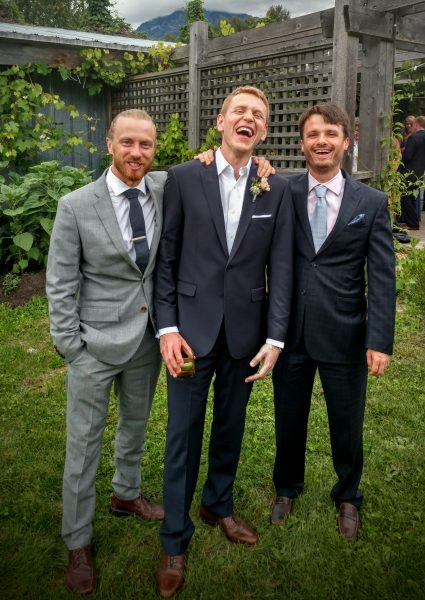](http://www.rdchambers.net/wp-content/uploads/2016/07/IMG_20160624_170341435_HDR.jpg) Myself, Nate, and George at Nate's wedding reception.\[/caption\]

Beyond that, the service, the setting, and the company were fantastic. The service was even officiated by Nate's sister, who is (or at least is soon-to-be) a reverend.

\[caption id="attachment\_1151" align="aligncenter" width="600"\][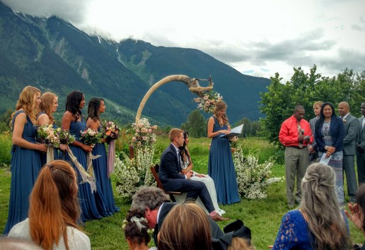](http://www.rdchambers.net/wp-content/uploads/2016/07/IMG_20160624_162127452_HDR.jpg) Nate's sister officiating the wedding reception, with the beautiful Coast Mountain Range in the background.\[/caption\]

 

\[caption id="attachment\_1152" align="aligncenter" width="600"\][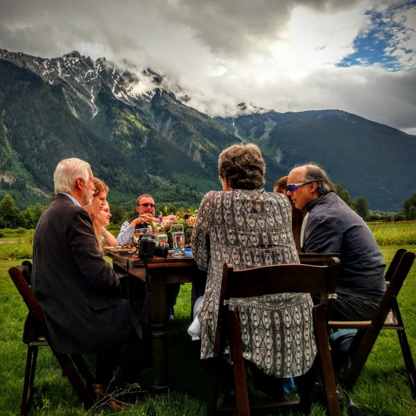](http://www.rdchambers.net/wp-content/uploads/2016/07/IMG_20160630_193938.jpg) The clouds starting to part during dinner.\[/caption\]

The general consensus was that it was the most well-done and beautiful wedding that anyone in attendance could remember, and I really can't imagine how it could be topped.

### Driving to Missoula

Unfortunately, attending the wedding slowed me down by about 4 or 5 days, so I had to do a one-day car rental to jump ahead a couple of hundred miles to Missoula, Montana. I actually picked up Len and Don on the way to help them avoid an especially desolate and mountainous stretch, and we got to check out charming Missoula for a night. One of the highlights was a tour of the Adventure Cycling Association's offices (that's the non-profit that publishes the maps for the Transamerica), which were probably the nicest non-profit offices I've ever seen.

\[caption id="attachment\_1150" align="aligncenter" width="600"\][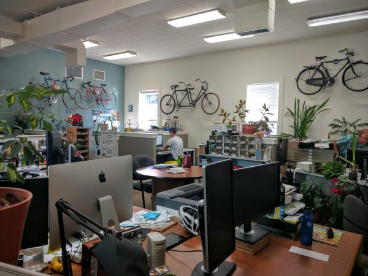](http://www.rdchambers.net/wp-content/uploads/2016/07/IMG_20160627_090953256.jpg) Offices of the Adventure Cycling Association in Missoula, Montana.\[/caption\]

After that, it was time to say goodbye to Len and Don, and head off on my own through the vast rangelands of rural Montana.
