I couldn't believe how big the state of Oregon was, so I was thrilled when I was able to start biking in Montana, a state that I'd never visited but which I imagined epitomized the enormous, unpopulated, and still partly wild Mountain West. Montana sure didn't let me down, and neither did the beautiful national parks in Wyoming: Yellowstone and Grand Teton.

### Montana

\[caption id="attachment_1190" align="aligncenter" width="600"\][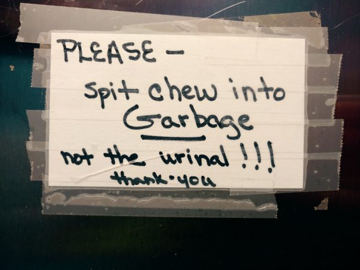](/wp-content/uploads/2016/07/IMG_20160629_170209166.jpg) One must observe the subtleties and niceties of Montana culture, if one is to fit in.\[/caption\]

I knew that Montana was famous for its mountains, and rightfully so. What I didn't fully appreciate is that, at least in the Southwestern part of the state that I visited, it's most prominent feature is its enormous valleys and rangelands. Some of the valleys were so big that they took several days to traverse on bike. The vast majority of the land was treeless and was used for cattle grazing.

\[caption id="attachment_1186" align="aligncenter" width="600"\][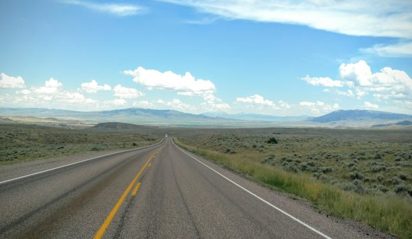](/wp-content/uploads/2016/07/IMG_20160630_152735285.jpg) The huge rich valleys of Montana dwarfed those of Oregon and Colorado.\[/caption\]

The high mountains, wide valleys, and oftentimes incredibly high cloud altitude made for beautiful displays. I learned quickly why they call it 'big sky country'.

\[caption id="attachment_1198" align="aligncenter" width="600"\][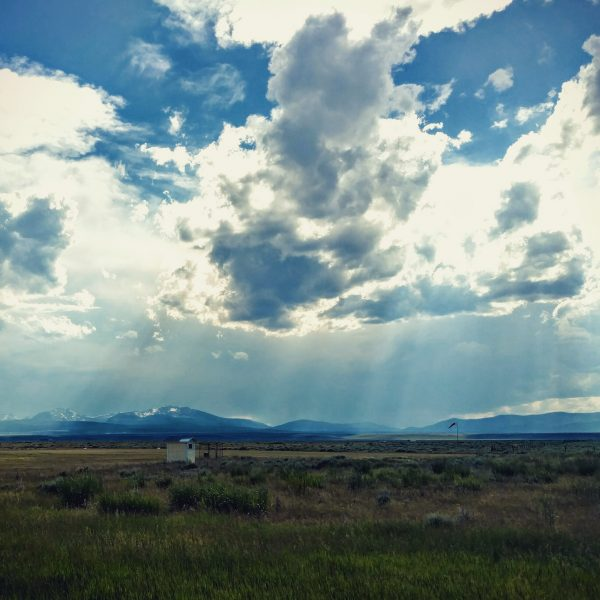](/wp-content/uploads/2016/07/IMG_20160630_193628.jpg) Montana: big mountains, wide valleys, and high clouds = big sky country.\[/caption\]

I loved the Montana scenery. I can't say that I really want to spend a winter there, but in summer, it was hard to beat.

And, the people were true salt of the earth. I've visited a lot of places that have a farming identity, but in which most people just work in service jobs. Not so in Montana - it was clear from the beat up pickup trucks and the grizzled old men that this was *real* farming country. And, unlike the rednecks in eastern Oregon, the real farmers in Montana were thrilled to meet bicyclists who enjoyed the beauty and solitude of the open country as much as they did. I felt completely welcomed by the locals, who aways waved and gave thumbs-up while passing me, and who drove safely and carefully around me.

\[gallery type="rectangular" ids="1184,1185,1187,1191,1197"\]

However, after many days of pedaling through the endless valleys, I was happy to see one of the valleys start undulating and taking on a much more aggressive character. I soon realized the reason: I was approaching Yellowstone.

\[caption id="attachment_1183" align="aligncenter" width="600"\][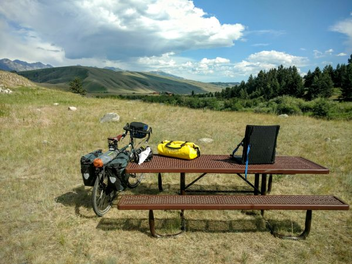](/wp-content/uploads/2016/07/IMG_20160702_170013392.jpg) The open rangeland gave way to undulating, sharp hills as I approached Yellowstone.\[/caption\]

As  I got closer, I began to see strikingly different mountains in the distance, and the rangeland gave way to meadows and patches of forest.

\[caption id="attachment_1196" align="aligncenter" width="600"\][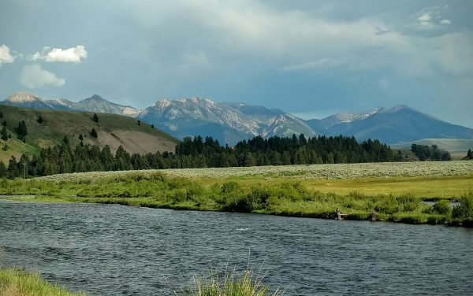](/wp-content/uploads/2016/07/IMG_20160702_215609.jpg) The Madison river flowed from the mineral-rich, warm geysers of yellowstone, which kept it full of life year-round and made for some of the best fly fishing in the world.\[/caption\]

As I approached West Yellowstone (the Montana town just before the Wyoming state border and park entrance), a localized but extremely heavy rain storm formed and began to chase me. I really wasn't in the mood, so I rushed onwards and was relieved when the road jogged to the right, taking me out of its path.

\[caption id="attachment_1181" align="aligncenter" width="600"\][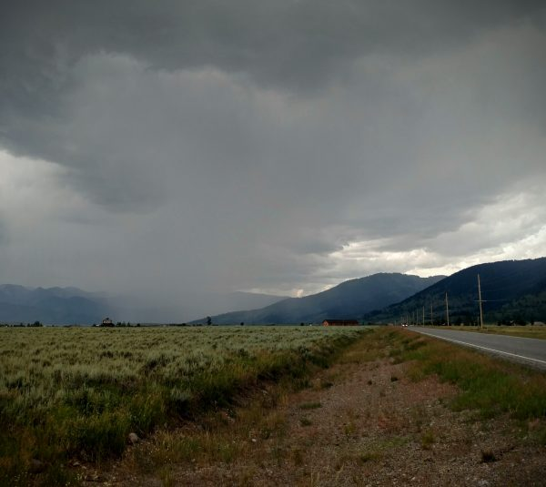](/wp-content/uploads/2016/07/IMG_20160703_124156355.jpg) Its not comforting to see a rainstorm like this chasing you on a bike.\[/caption\]

It was with mixed emotions, then, that I briefly met a bike tourist from Kazakhstan. I asked him where he was biking, and he simply said 'Around the world'. His gear was extremely inexpensive and cobbled together, and he was heading directly into the torrential rainstorm. As there was nothing he could do about it, I simply wished him luck, and reflected on easy it is to get hung up on gear, costs, and logistics, while all it really takes to do an incredible journey is curiosity, dedication, and a willingness to deal with some discomfort.

[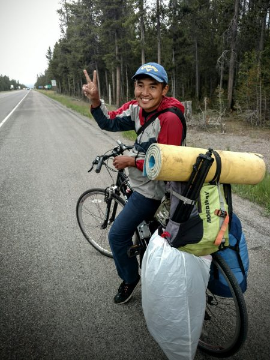](/wp-content/uploads/2016/07/IMG_20160703_133107821.jpg)

### Yellowstone

Yellowstone is located in an incredible geothermally-active basin. Even if it didn't have nearly all of the world's notable geysers, it would still be famous for its beauty. Consequently, it's one of the most visited National Parks (about 4 million visitors per year). And, as far as I can tell, every single one of them arrives in a 35-foot RV, towing a hummer, which is towing an ATV.

Since the mid-1970s, the Transamerica bike route (again - the most famous touring bike route in the US) has cut through Yellowstone. Yet, in the intervening 40 years, Yellowstone has yet to build a bike lane, or even a real shoulder, let alone a bike path, along the route. It is universally hated among cyclists, many of whom try to detour around Yellowstone. It's such an incredible shame, and an embarassment to the Park Service, that the park continues to expand its facilities for vehicles while ignoring the dangers to the huge numbers of travelers on bikes. The rangers told me that just a few days before I arrived, a cyclist was med-evac'd from the park after being run off the road by an SUV, and that this was a common occurrence.

Nonetheless, my strategy was just to wake up early and be on the road as the sun rose. That gave me about 4-5 hours of cycling before traffic picked up, and I could continue after dinner when it died down again.

It also gave me a chance to see Yellowstone in almost complete solitude, bathed in fog as the sun rose, with elk and buffalo roaming the fields. This was a truly precious experience.

[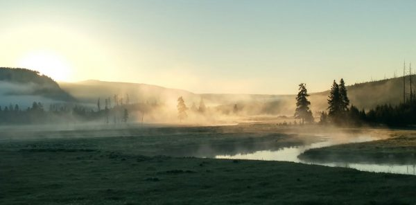](/wp-content/uploads/2016/07/IMG_20160704_061219323_HDR.jpg)

For all its faults, Yellowstone is simply a victim of its own beauty and uniqueness. The park is easy to fall in love with, and it is home to wildlife--bears, bison, elk, deer, fish, and more--in preposterous abundance.

\[gallery type="rectangular" ids="1179,1176,1175,1174,1173,1172,1171"\]

All of the national parks offer tremendous solitude if you venture so much as a mile off of the main tourist path. However, Yellowstone offers a tourist focal point that I don't think is matched by any other National Park: the Ol' Faithful geyser. It is quite large--not their largest--but it erupts with crowd-pleasing regularity every 90 minutes.

\[caption id="attachment_1170" align="aligncenter" width="600"\][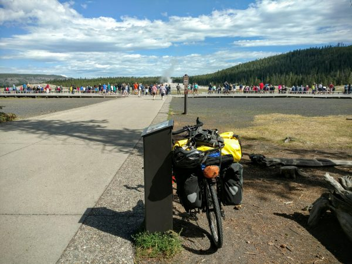](/wp-content/uploads/2016/07/IMG_20160704_103859833.jpg) As usual, I parked my bike in plain view and experienced no problems.\[/caption\]

\[caption id="attachment_1167" align="aligncenter" width="600"\][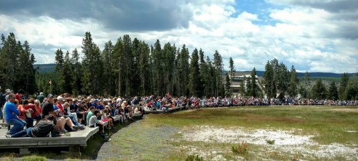](/wp-content/uploads/2016/07/IMG_20160704_123139163.jpg) Thousands of spectators watch the Ol' Faithful geyser erupt.\[/caption\]

\[caption id="attachment_1169" align="aligncenter" width="474"\][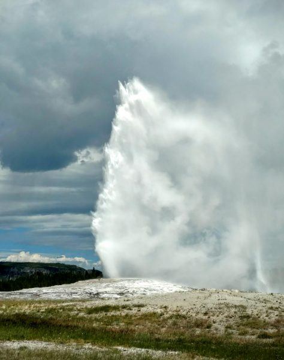](/wp-content/uploads/2016/07/IMG_20160704_110719717.jpg) Ol' Faithful erupting.\[/caption\]

The eruption truly is magnificent, and a delight to watch. I think it is also responsible for bringing *such* large crowds to the park, since it seems to fit so well with our netflix- and cable-news-obsessed culture. Whereas most national parks just *sit there*, the geysers in Yellowstone *do something*! You know when it's supposed to happen, and when it's done, you can check it off your list, hop in your RV, and motor on. Or, in my case, pedal on.

After checking out the big geysers, I took a little hike (one of very few on this bike journey), and encountered this monstrosity of a buffalo. It's hard to describe how prehistoric and impressive these animals are in person. But, apparently, they are so accustomed to tourists that, if you keep a healthy distance, they will ignore you.

[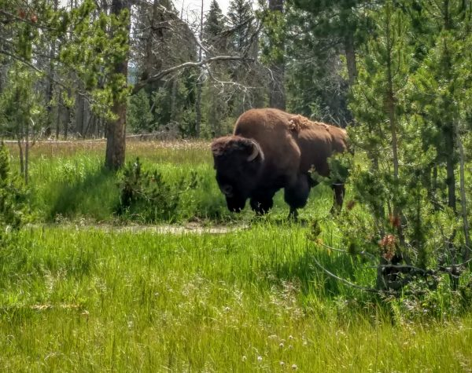](/wp-content/uploads/2016/07/IMG_20160704_113030871_HDR.jpg)

Eventually, in a pouring rain storm and in vicious traffic, I summited the peak that separates the basin with most of the geyers from the basin with Lake Yellowstone, crossing the Continental Divide several times. The sky immediately cleared up, and my first views of beautiful Lake Yellowstone were the kinds of moments that made all of the discomfort worth it.

\[caption id="attachment_1166" align="aligncenter" width="600"\][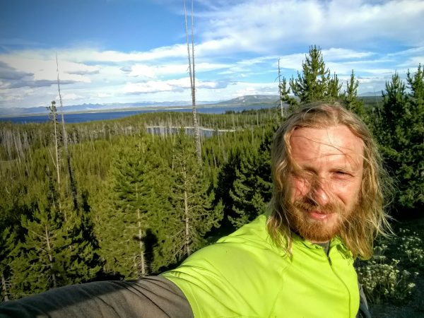](/wp-content/uploads/2016/07/IMG_20160704_183655311.jpg) Selfie on the descent towards Lake Yellowstone\[/caption\]

The next morning, I watched the sun rise over the lake, and cooked up my traditional - *delicious* - oatmeal and coffee breakfast.

[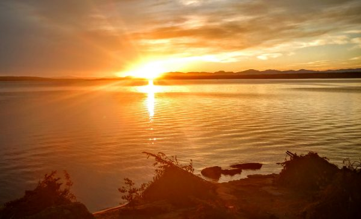](/wp-content/uploads/2016/07/IMG_20160705_055301994_HDR.jpg)

\[caption id="attachment_1193" align="aligncenter" width="600"\][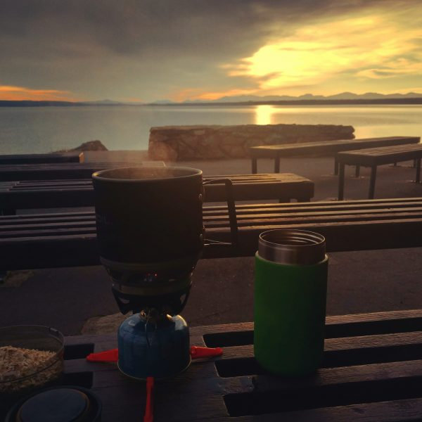](/wp-content/uploads/2016/07/IMG_20160705_072148.jpg) Breakfast at Lake Yellowstone\[/caption\]

The next day, I battled traffic once again to finally leave Yellowstone and move on to a much friendlier National Park - Grand Teton.

### Grand Teton

Grand Teton National Park is named after a ridge of striking mountains - the Tetons - that line up almost like soldiers in an old battle formation on the edge of a breathtaking lake. In many ways, it's the opposite of Yellowstone. It is purely scenery. It doesn't *do* anything, the rangers are friendly, and it's not strained beyond its capacity. Oh, and it has an *incredible* and heavily-used bike path that made the park a true pleasure to visit.

[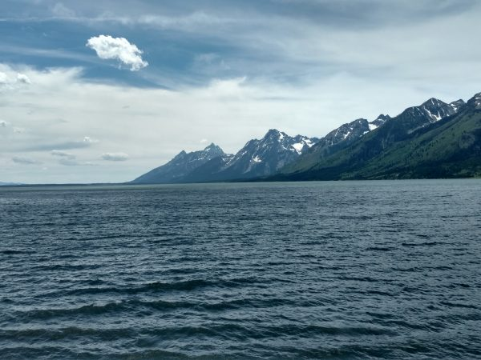](/wp-content/uploads/2016/07/IMG_20160705_135934496_HDR.jpg)

Perhaps my favorite moment at Grand Teton was meeting this man. We were both stopped at a roadside map, when I noticed his Argentina license plate. I said hello, and he replied despondently that he didn't speak English. I busted out my admittedly-rusty Spanish, and his eyes lit up. He hadn't had anyone to talk to in days, and he was hopelessly lost. So, he got to pump me for information, and I got to hear about his motorcycle trip (Tierra del fuego to Alaska, *and back!)*, as well as to practice my Spanish.

[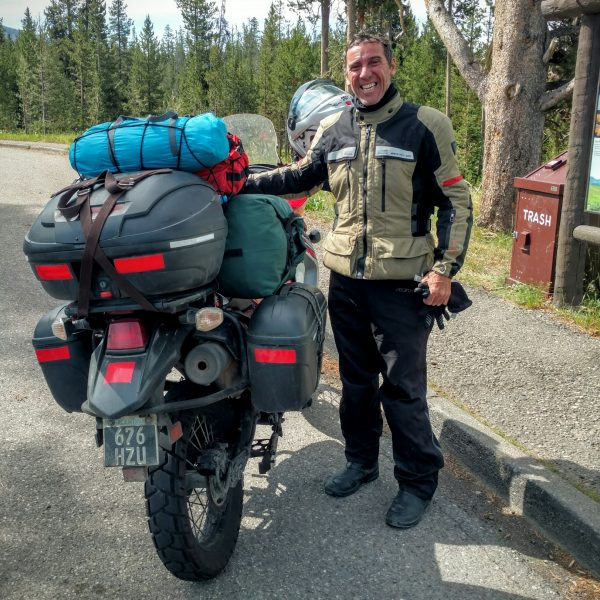](/wp-content/uploads/2016/07/IMG_20160705_103212361_HDR.jpg)

After Grand Teton, I departed the Transamerica and headed down to Jackson Hole to rent a car. You see, my plans had changed: my college friend Sarah and arranged to meet me in Colorado to do a tour of the mountains near Denver, which sounded incredible after so much solitude, and so I was thrilled to skip the barren tundra of Wyoming to join her.
