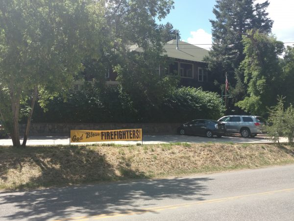

A couple of weeks into my trip, I was thrilled to hear that Sarah, my friend from Harvey Mudd, might be able to join me at the end of my bike trip.

Sarah is a serious bad-ass and has more bike touring experience than me or pretty much anyone else I know. She's toured a ton in Northern Europe and also in Eastern Europe - a place where I stopped a bike tour because the roads were so dangerous. Now, she lives in Hawaii working as an Engineer to keep things from blowing up. I was super excited to have a companion, especially one who is fun and good at biking, so I decided to adjust my plans however necessary to meet up.

Unfortunately, Hawaii makes for inconvenient travel to... well... pretty much anywhere other than Hawaii. We discussed having Sarah join me in Wyoming so we could finish my planned route to Denver together, but even with Sarah's uber-VIP airline status, the travel time and bike stowage fees were prohibitive.

So, we decided on an alternate plan: I would rent a car from Jackson, Wyoming (just South of Grand Teton), and I would drive down to meet her in Denver. From there, we could construct some interesting loops through the mountains near Denver and Boulder. This meant that she could simply rent a bike in Denver, making the logistics much easier.

My drive down from Jackson, through Wyoming, was bittersweet. Wyoming is known as the most desolate, wind-swept stretch of the transam. Cyclists were few and far-between, but when I did see a few hardy soles battling 35 mph headwinds as they summitted huge, unrewarding grassland hills, I waved and gave them a thumbs-up. On the one hand, I was happy to trade this stretch for the mountains of Colorado. But, on the other, it would have felt really great to know that I had been able to cycle through Wyoming.

So it was that Sarah and I met at the home of our mutual college friend, Lindsay, in Denver. She has a beautiful home and was such a consummate host that now I pretty much feel like I've treated everybody who ever stayed with me like crap. Besides providing us with hotel-like lodging, she took lots of time from her crazy busy schedule to hang out with us.

Eventually, we headed off, two extremely fair-skinned travelers doing our best to avoid the merciless summer sunlight.

One of the great things about Denver and Boulder is that, even on a bike, you feel like a real person - an at-least partially-functioning member of society. Like, for example, this giant REI is located right at the intersection of a ton of beautiful, long commuter bike paths, and it seems to have just almost as much bike parking as car parking.

We continued on towards Boulder, which is about 20 miles northwest from Denver, on gorgeous bike paths, including the Route 36 "bike highway". We noticed with curiosity a foreboding smoke plume rising up from the mountains behind Boulder, which you can see in the selfie below.

That smoke plume turned out to be a substantial wildfire that threatened the town of Nederland, where we had planned to bike the next day. Uncertain as to how this would affect our journey, we nonetheless met our extremely generous AirBnB host in a downtown restaurant for what would be one of the many spectacular vegetarian meals that I ate in Boulder.

After dinner, as the sun was setting, our host nonchalantly informed us that his house was actually not in Boulder. It was up about 2,000 feet of elevation, in the mountains, *immediately adjacent to the forest fire* and under a very real threat of evacuation.

This was an unwelcome development, but we didn't really have a choice, so we saddled up and followed him through the heavy nighttime commute into the mountains west of Boulder. Sarah and I were already exhausted before dinner, and this was Sarah's *first day* on the tour. The climb seemed interminable, up almost humorously steep inclines, as the road surface degraded from pavement to dirt. Sarah was nearly delirious with exhaustion, but I noticed with great respect that, for better or worse, she didn't complain and somehow she just kept pedaling.

We reached our host's space-age sky castle without a drop of energy to spare, and the next morning the fire forced us to give up every inch of elevation descending back into Boulder.

So, we decided to detour to the North, through Lyons and towards Allenspark. The campground in Lyons was unexpectedly shut down, so with no other options we simply started ascending through a canyon into the mountains. After a couple of hours, the canyon finally began to open up and we found a serviceable flat area / ditch to camp in next to the road.

Continuing to ride by the seat of our pants, we decided to visit Rocky Mountain National Park, via the surprisingly appealing town of Estes Park. Rocky Mountain NP was as gorgeous as we expected, with awesome public transportation, and it was great to spend a day off the saddle and hiking.

The descent into Estes Park had been magnificent, and we dreaded retracing our steps up the enormous incline. Luckily, we found a cool back road that made the ascent interesting, and we enjoyed a couple of days of cycling through the mountains and back to Boulder. As we approached Boulder, evidence of the forest fire was everywhere, and many of the houses had signs in their front yards thanking the volunteer firefighters.

\[caption id="attachment_1224" align="aligncenter" width="600"\] A sign thanking the volunteer firefighters. Was it made on short notice, or do they just re-use the same sign for each forest fire?\[/caption\]

We stayed two nights in an awesome AirBnB in boulder, during which I learned just how much a human being can desire to go on a tubing trip in the Boulder creek (which, unfortunately, was not possible). Then, we headed back down the Rt 36 bike highway to Lindsay's house. Once again, she was a fantastic hostess.

This time, I decided to box my own bike. It turns out, it's super easy!!! I pulled a small-ish bike box from the dumpster behind a bike shop (with their permission and encouragement), and I broke down the bike and saran-wrapped it all together.

Worked like a charm! And, it was *much* smaller and more durable than when I let a bike shop do it for me.

### Bike Trip Post-Mortem

With my bike all packed away in its new cardboard home, I reflected on my bike trip. In all, I went 1,200 miles in 29 days of biking, for an average of 41.4 miles/day. My longest day was 58.3 miles. To be honest, I didn't really push it that hard, because I wanted to enjoy myself and the scenery, and biking further didn't seem to help with that. I was also hampered by knee problems the first 2 weeks due to my near-total lack of pre-trip conditioning.

My biggest day of elevation change was 4,413 feet, and several other days came close. Overall, I climbed 49,902 feet, which is almost twice the height of Mount Everest, or around 40 empire state buildings. Cool!

The scenery and variety of this stretch of the transamerica trail was stunning. However, I felt that the route was unsafe and unnerving due to the amount of traffic and the almost total lack of bike lanes. Most cyclists I met felt the same way. While there were stretches on true back-roads that felt safe and peaceful, much of the ride was a constant battle with road noise and passing cars. Still, this trip was full of incredible memories, and after years of wistfully watching documentaries about the National Parks, I feel privileged to have gotten more in touch with the great American West. I also appreciated the warmth and english-speaking ability of all of the travelers and locals that I met. This trip was far more socially engaging than my trip through Europe.

If I were to attempt another trip, I would unequivocally do a bikepacking trip--that is, I would go lighter on my gear, use a mountain bike instead of a hybrid bike, and I would do an off-road path such as the Great Divide Mountain Bike Route, which follows mostly low-traffic backroads or forest service roads, as well as a bit of single-track. Then, instead of being challenged by traffic, I could be challenged by difficult terrain and  wilderness seclusion. Maybe next year!
